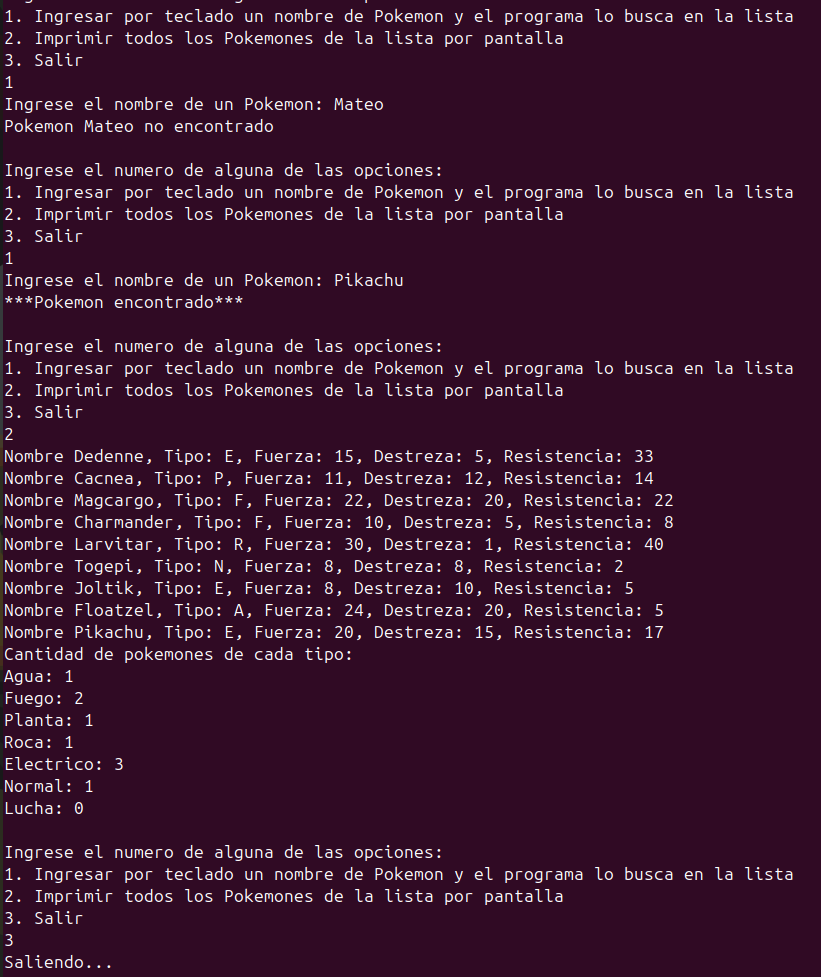

<div align="right">

</div>

# TDA HASH

## Alumno: Mateo Gonzalez Pautaso - 111699 - magonzalezp@fi.uba.ar

- Para compilar:

```bash
gcc -std=c99 -Wall -Wconversion -Wtype-limits -pedantic -Werror -O2 -g src/*.c tp_hash.c -o hash
```

- Para ejecutar:

```bash
./hash ejemplos/pokedex.csv
```

- Para ejecutar con valgrind:
```bash
valgrind --leak-check=full --track-origins=yes --show-reachable=yes --error-exitcode=2 --show-leak-kinds=all --trace-children=yes ./hash ejemplos/pokedex.csv
```
---
##  Funcionamiento

<div align="center">

</div>
&nbsp;

El programa recibe el nombre de un archivo por parametro, verificando que efectivamente se haya pasado uno y en el caso que no se haya hecho, imprimira un mensaje de error y terminara la ejecución del programa. Luego lo abre con la función abrir_archivo_csv() asignandole memoria, la funcion retorna un struct archivo_csv donde se almacena el separador y un FILE* a un archivo csv.

Posterior a esta tarea se crea una pokedex con hash_crear() y se asigna memoria nuevamente, dicha funcion retorna un struct hash.

Como ambas funciones que crean las estructuras asignan memoria, verificamos que esta misma no haya fallado y seguimos con la ejecución de nuestro programa.

<div align="center">

</div>
&nbsp;

Seguidamente se crea un arreglo de punteros a funciones, con estas mismas se castearan las columnas del archivo csv a los datos requeridos por el programa. Dichas funciones deben estar en el mismo orden de aparición que las columnas del archivo a procesar para evitar problemas de tipos de datos distintos.

**Pikachu;E;20;15;17**

Como nuestro archivo tiene lineas de este formato, el orden de aparicion de las funciones debe ser tal cual estan implementadas en tp_hash.c, si nuestro archivo tuviese distinta disposición habría que ajustar el orden. Luego de esto, se crean las variables donde se copiara la informacion de las columnas de los archivos. Cuando creamos el arreglo de punteros a ctx almacenamos las direcciones de memoria de las variables para cargar los pokemones al hash pokedex una vez sean parseadas correctamente.

Al poner la función leer_linea_csv() que devuelve la cantidad de columnas leidas correctamente, el programa se ejecutara hasta que se produzca una falla o se llegue al final del archivo. Pero esta función no solo retorna este dato sino que también se encarga de leer linea a linea el archivo, separar estas mismas segun el separador y armar un char **split_strings donde estaran los datos de las variables de void \*ctx[5]. Una vez finalizadas estas tareas, libera la memoria del char\*\* y retorna el dato esperado. En el caso que alguna asignación de memoria falle, alguna función sea NULL o el parseo no se ejecute correctamente, finaliza la ejecución y retorna en que columna fallo.

<div align="center">

</div>
&nbsp;

Una vez los datos fueron cargados a las variables, se asigna memoria para el struct pokemon * para poder ser agregado al hash pokedex. Los datos de las variables y el pokemon son pasados por parametro a la funcion asignar_datos_pokemones() y luego este pokemon es pasado a hash_insertar(). Se repite el ciclo while sucesivamente hasta terminar de leer todo el archivo csv.

Al momento de salir del while, se recurre a la funcion cerrar_archivo_csv() para liberar toda la memoria utilizada por el archivo csv. Luego se llama a la funcion menu_usuario() que se encarga de:
  - Pedir al usuario que ingrese un nombre y buscarlo en la Pokedex Hash.
  - Imprimir los pokemones por pantalla en un formato agradable.
  - Salir del programa.

<div align="center">

</div>
&nbsp;

Una vez se finaliza la ejecucion del menu, se recurre a la funcion hash_destruir_todo() que recibe al hash Pokedex y a la funcion destructora liberar_pokemon() para vaciar el contenido del nodo y liberar toda memoria utilizada.

Al principio del trabajo pense en implementarlo con listas, pero luego de pensar las funciones me di cuenta que iba a ser mucho mas facil con nodos. Mucha de la logica sobre como operar con estos ya la tenia del trabajo de Lista, así que esa parte estaba cubierta. Luego busque varías funciones de hash hasta que encontre la djb2, tuve que hacer casteos para que el compilador no tenga problemas por los flags.

La funcion que mas tiempo requirio fue rehash, ya que en un principio creaba un hash nuevo, recorria el viejo e iba insertando los nodos en el nuevo, todo este proceso asignaba memoria y liberaba por lo que era mas suceptible a fallos. La forma final fue crear una nueva tabla, recorrer la vieja e ir cambiando los nodos de lugar, al final liberaba la tabla antigua y asignaba la nueva como tabla del hash. El factor de carga maximo en mi trabajo es de 0.7, considerando que la funcion djb2 es suficientemente buena para evitar la mayor cantidad de colisiones posibles.

Con el resto de las funciones no tuve muchos mas problemas que pensar un rato y hacer bocetos de funciones hasta llegar a la version final. Como el bot me paso las pruebas al segundo intento luego de solucionar los conflictos de la primera entrega, no necesite implementar muchas mas pruebas para casos especificos.

## Respuestas a las preguntas teóricas

### Qué es un diccionario

Un diccionario es una estructura de datos que almacena pares clave-valor con las siguientes características:
  - Clave: es el "identificador" para acceder al valor
  - Valor: es el valor asociado a esa clave

Las operaciones de agregar, quitar y buscar dentro de un diccionario son muy eficientes, ya que al tener una clave no dependemos del orden de los datos. La complejidad de estas es cercana a O(1).

Si nuestra funcion de hash no es eficiente o el tamaño de la tabla no es lo suficientemente grande, podemos aumentar la complejidad temporal del diccionario.

Al pasar la clave por la funcion de hash obtenemos un indice cualquiera, de todos modos, los valores se obtienen mediante las claves y no los indices. Cada clave debe ser unica, en el caso de haber colision generalmente se reemplaza el valor asociado a esta.

### 3 formas diferentes de implementar un diccionario

#### Tabla de Hash

En esta implementacion usamos un array como tabla para insertar los pares clave-valor, la funcion de hash convierte la clave en un indice para acceder al valor del mismo. La funcion debe evitar las colisiones para no conectar nodos y asi aumentar el tiempo de busqueda, ya que esta implementacion tiene un promedio de complejidad O(1) para busquedas. Una desventaja es que usa mas memoria porque debe almacenar las claves y los nodos por posibles colisiones.

Nuesta funcion de hash puede recibir todo tipo de claves, aunque si queremos que retorne indices dentro de la capacidad de nuestra tabla hay que aplicar el modulo a ese valor por la capacidad de la misma.

<div align="center">

</div>
&nbsp;

#### Lista enlazada

En esta implementacion se utiliza una lista con nodos que contienen los pares clave-valor, con lo cual tenemos una desventaja a la hora de recorrer el diccionario pero es mas sencilla de implementar ya que no requiere rehash. En el peor de los casos tenemos que recorrer la lista completa y esto tiene una complejidad temporal O(n).

<div align="center">

</div>
&nbsp;

#### ABB

En esta implementacion se utiliza un Arbol Binario de Busqueda donde los nodos del arbol contienen los pares clave-valor, es mas eficiente a la hora de recorrerlo con una complejidad de O(log n). La idea es que el arbol no este desbalanceado sino los tiempos pueden aumentar a O(n).

Las claves menores suelen ir a la izquierda y las mayores a la derecha, como el arbol esta balanceado los datos se almacenan en un orden segun las claves. No necesitamos una funcion de hash pero si una funcion comparadora para las claves.

<div align="center">

</div>
&nbsp;

### Qué es una función de hash y qué características debe tener para nuestro problema en particular

Una funcion de hash es una funcion que recibe por parametro una clave y mediante un algoritmo la transforma a un numero. Nosotros a este numero le aplicamos el modulo por la capacidad de la tabla y asi obtenemos los indices de la misma para insertar los nodos.

La funcion de hash debe generar valores distribuidos uniformemente para evitar la mayor cantidad de colisiones posibles, ademas, para la misma clave siempre debe generar la misma salida y viceversa. Aunque esto no siempre es posible ya que las computadoras son deterministicas y no tienen la capacidad de generar numeros aleatorios, también debe ser rapida incluso para claves largas.

### Qué es una tabla de Hash y los diferentes métodos de resolución de colisiones vistos (encadenamiento, probing, etc)

Una tabla de hash es un arreglo que asocia claves con valores mediante el uso de una funcion de hash, al pasar la clave por dicha funcion obtenemos el indice dentro del rango. Dependiendo del tipo de Hash tenemos varias formas de solucionar las colisiones:

#### Hash abierto

Los hashes abiertos son de direccionamiento cerrado. Se utilizan estructuras como listas o nodos enlazados para encadenar los pares clave-valor en cada indice de la tabla, esto ocurre cuando hay una colision. Esta misma ocurre cuando para la misma clave, la funcion de hash nos devuelve el mismo indice. Por ejemplo tenemos el par ("Mateo", 10) almacenado en el indice 3 y al insertar el par ("Lupe", 18) la funcion nos devuelve el indice 3 tambien, por lo que habra que enlazar los nodos.

<div align="center">

</div>
&nbsp;

#### Hash cerrado

Los hashes abiertos son de direccionamiento abierto. Todos los valores se guardan dentro de la misma tabla y el tamaño de esta debe ser mayor o igual al numero de claves, aunque no significa que siempre se guarden en el indice que devuelve la funcion de hash.

Las colisiones se solucionan usando probing lineal, si una posicion calculada por la funcion de hash esta ocupada, revisamos la siguiente posicion hasta encontrar una libre. Para encontrar un valor, se realiza el mismo recorrido en caso de no estar en el indice dado.

El probing cuadratico es muy parecido al lineal solo que en vez de hacer indice + i para encontrar la siguiente posicion, hace indice + (i^2).

El otro metodo es con Hash Doble, basicamente se le aplica una segunda funcion de hash a la clave cuando hay colision.

<div align="center">

</div>
&nbsp;

### Explique por qué es importante el tamaño de la tabla (tanto para tablas abiertas como cerradas)

El tamaño de la tabla es importante para minimizar la cantidad de colisiones. Esto es debido a que el indice de la tabla de hash se calcula mediante el valor de retorno de nuestra funcion de hash modulo la capacidad de la misma, asi logramos que los indices de la tabla esten dentro de nuestro rango.

Cuantos mas pares claves-valor tengamos y menos posiciones, se generan mas colisiones y asi logramos una menor eficiencia a la hora de buscar elementos, ya que habra que recorrer una secuencia de nodos para el caso de hash abierto.

Para el caso de hash cerrado, mientras mas pares se agreguen se va a ir llenando la tabla y va a ser necesario agrandarla para poder insertar mas.

### Dado que en una tabla abierta se pueden encadenar colisiones sin importar el tamaño de la tabla, ¿Realmente importa el tamaño?

Si que importa, ya que si tenemos una tabla chica con muchas colisiones, en cada indice va a haber mas de un nodo enlazado. Debido a esto vamos a tener que recorrer todos hasta encontrar el que queriamos, por lo que estariamos disminuyendo la eficiencia de busqueda por la que son famosos los diccionarios.

Para esto esta la funcion de rehash dentro de la implementacion, donde cada vez que es invocada (factor de carga > 0.7) se duplica la capacidad de la tabla y asi no tenemos nodos enlazados en los indices.

## Hash

__typedef struct hash hash_t__

Es la estructura utilizada para describir el hash, tiene una tabla de hash del tipo par_t** con la capacidad (size_t) especificada dentro de la estructura, ademas tiene un size_t cantidad para llevar un recuento de la cantidad de pares clave-valor.

__typedef struct par par_t__

Es la estructura utilizada para describir al nodo que contiene el par clave-valor, tiene una referencia al siguiente nodo y claramente los valores mencionados anteriormente.

__hash_t* hash_crear(size_t capacidad_inicial)__

La funcion se encarga de crear el hash, primero revisa si la capacidad no es nula y luego procede a asignar memoria para el mismo. En caso que esta falle, retorna NULL, en caso contrario cambia la capacidad inicial, de ser necesario, y asigna memoria nuevamente para la tabla de hash. Finalmente asigna la capacidad y cantidad, como todas las operaciones son O(1), la funcion tambien es O(1).

__void hash_destruir(hash_t* hash)__

La funcion se encarga de destruir el hash y su tabla cuando no se asigna memoria para el valor de par_t. Esto lo logra llamando a la funcion hash_destruir_todo y pasandole una funcion destructora nula por parametro. La complejidad de esta funcion es O(n).

__void hash_destruir_todo(hash_t* hash, void (\*destructor)(void\*))__

La funcion es como hash_destruir solo que tambien libera el contenido del nodo. La tabla es iterada recorriendo por indices con un bucle for iterando sobre la capacidad del hash, dentro del for hay un bucle while para iterar sobre los nodos. En este proceso libera la clave del nodo, si la funcion destructora es valida, la aplica al valor y finalmente libera el nodo. Una vez salido de las iteraciones, libera la tabla de hash y el hash. La complejidad de esta funcion depende de la cantidad de par_t que haya dentro de los indices de las tablas, por lo que la complejidad seria O(c), siendo c el valor mencionado anteriormente. Forma parte de la familia O(n).

__size_t hash_cantidad(hash_t* hash)__

La funcion retorna la cantidad de nodos par_t presentes en el hash, retorna el valor almacenado en el struct, por lo que la complejidad de la funcion es O(1).

__bool hash_entrada_valida(hash_t *hash, char \*clave)__

La funcion verifica que el hash y la clave sean validas, es decir, no sean NULL y ademas comprueba que la clave no este vacía retornando un bool. La complejidad de la funcion es O(1).

__hash_t *rehash(hash_t *hash)__

La funcion se encarga de reordenar, rehashear, la tabla de hash cuanto la cantidad de nodos presentes es alta para la cantidad de indices en la tabla. Suponiendo que la funcion de hash es buena y evita la mayor cantidad de colisiones, el factor de carga lo podemos calcular como (cantidad + 1) / capacidad. En el proceso se duplica la capacidad y se asigna memoria para la nueva tabla, se recorre la tabla vieja y a cada clave se le asigna la nueva posicion. Con esta nueva posicion se cambian las referencias de las tablas a los nodos y se va vaciando la tabla vieja hasta quedar vacía, para poder liberar la memoria. Finalmente al hash se le asigna la nueva tabla y capacidad para retornarlo. La complejidad seria O(c), siendo c la cantidad de par_t en la tabla vieja, por lo que sería parte de O(n).

__bool crear_nodo_e_insertar(par_t **tabla_hash, size_t posicion, char *clave, void *valor)__

La funcion asigna memoria para la nueva clave, copia el valor pasado por parametro a esta y se asigna memoria para el nodo. En caso de fallo, se libera la memoria y retorna false, sino al nuevo nodo se le asigna clave-valor y es insertado en la tabla. La complejidad de esta funcion depende de strcpy y strlen que son O(n) por la cantidad de caracteres a copiar, el resto de las instrucciones son O(1). La complejidad es O(n).

__bool hash_insertar(hash_t* hash, char\* clave, void* valor, void*\* encontrado)__

La funcion inserta un par_t a la tabla de hash, primero revisa el factor de carga y luego procede a iterar el arbol. En caso de haber otro valor para la misma clave, lo reemplaza y guarda en encontrado el valor viejo. Si no hay coincidencia, utiliza la funcion mencionada anteriormente y retorna true. La complejidad de la funcion depende de la iteracion y la posible creacion del nodo siendo O(c), por lo que sería parte de O(n).

__void *hash_buscar_aux(hash_t *hash, char *clave, bool *centinela)__

Como las funciones de buscar y contiene son muy parecidas, solo difieren en lo que retornan, lo mas conveniente era crear una funcion que hiciera ambas. La funcion recorre la tabla de hash y en caso de encontrar la clave coincidente, asigna al centinela como true y retorna el valor correspondiente a la clave. Si no la encuentra devuelve NULL y el centinela mantiene su valor inicial de false. La complejidad de la funcion es O(n).

__void* hash_buscar(hash_t* hash, char* clave)__

La funcion llama a hash_buscar_aux y aprovecha el valor de retorno de esta para devolverlo tambien, la funcion depende de la mencionada anteriormente, siendo O(n).

__bool hash_contiene(hash_t* hash, char* clave)__

La funcion llama a hash_buscar_aux y retorna el centinela que fue modificado en caso de acierto, la complejidad es O(n).

__void* hash_quitar(hash_t* hash, char* clave)__

La funcion quita el nodo con la clave pasada por parametro y retorna el valor del mismo, liberando la memoria de la clave y del nodo. En caso de no haber coincidencia retorna NULL, también cambia las referencias de los nodos para evitar perdidas de memoria. La complejidad de la funcion es O(n).

__size_t hash_iterar(hash_t* hash, bool (\*f)(char\*, void\*, void*), void* ctx)__

La funcion itera todos los nodos de la tabla de hash y aplica la funcion pasada por parametro al contenido del mismo, en caso de retornar false devuelve la cantidad de elementos iterados. El metodo de iteracion es como el de las funciones explicadas anteriormente, por lo que la complejidad de la funcion es O(n).

__unsigned long hash(char *str)__

La funcion es una pequeña modificacion de djb2 con casteos para evitar problemas con las flags del compilador, es una de las funciones de hash mas eficientes que hay. Creditos a [djb2](http://www.cse.yorku.ca/~oz/hash.html).

__size_t hash_modulo(char *str, size_t capacidad)__

La funcion recibe el valor de djb2 y aplica el modulo con la capacidad para obtener los indices de la tabla dentro de nuestro rango.

## Menu

__bool crear_string_nuevo(const char *str, void *ctx)__

Explicada en el TP1

__bool leer_caracter(const char *str, void *ctx)__

Explicada en el TP1

__bool leer_int(const char *str, void *ctx)__

Explicada en el TP1

__void menu_usuario(hash_t *hash)__

La funcion es muy parecida a la de TDA ABB con la diferencia de la estructura utilizada, se busca el elemento con hash_buscar() y asi sucesivamente.

## Pokemon

__int comparar_nombre_pokemon(void \*\_p1, void \*\_p2)__

Explicada en el TDA Lista

__void asignar_datos_pokemones(struct pokemon *pokemon, char *nombre, char tipo, int fuerza, int destreza, int resistencia)__

Explicada en el TDA Lista

__bool contar\_imprimir\_pokemon(void \*\_p1, void \*\_cantidad\_tipo)__

Explicada en el TDA ABB

__void imprimir_pokedex(hash_t *hash)__

La funcion recibe el Hash y usando la funcion para iterar, se le pasa por parametro una funcion para contar los pokemones por tipo e imprimirlo. Luego de salir del iterador, imprime la cantidad de pokemones por tipo y asi logra un formato agradable para el usuario. La complejidad de la funcion depende de contar_imprimir_pokemon() y de hash_iterar(), como estas son O(1) y O(n), la funcion tiene una complejidad de O(n).

__void liberar_pokemon(void *contenido)__

La funcion fue explicada en TDA Lista y se mantiene igual.

## CSV

Toda la implementacion y explicacion de estas funciones esta explicado en el informe del TP1.