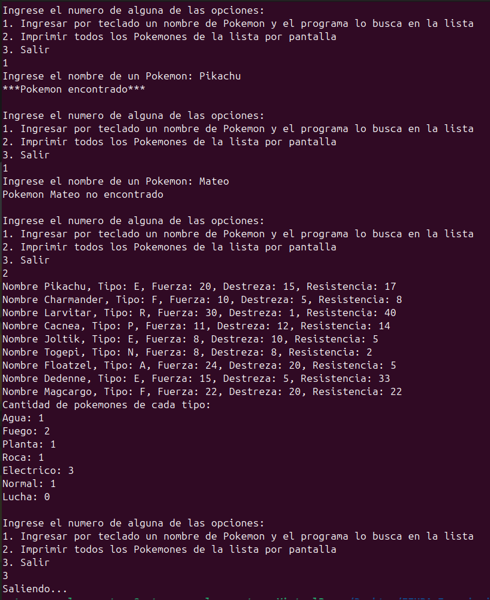

<div align="right">

</div>

# TDA LISTA

## Alumno: Mateo Gonzalez Pautaso - 111699 - magonzalezp@fi.uba.ar

- Para compilar:

```bash
gcc -std=c99 -Wall -Wconversion -Wtype-limits -pedantic -Werror -O2 -g src/*.c tp_lista.c -o lista
```

- Para ejecutar:

```bash
./lista ejemplos/pokedex.csv
```

- Para ejecutar con valgrind:
```bash
valgrind --leak-check=full --track-origins=yes --show-reachable=yes --error-exitcode=2 --show-leak-kinds=all --trace-children=yes ./lista ejemplos/pokedex.csv
```

---

##  Funcionamiento

<div align="center">

</div>
&nbsp;

El programa recibe el nombre de un archivo por parametro, verificando que efectivamente se haya pasado uno y en el caso que no se haya hecho, imprimira un mensaje de error y terminara la ejecución del programa. Luego lo abre con la función abrir_archivo_csv() asignandole memoria, la funcion retorna un struct archivo_csv donde se almacena el separador y un FILE* a un archivo csv.

Posterior a esta tarea se crea una pokedex con lista_crear() y se asigna memoria nuevamente, dicha funcion retorna un struct lista. La lista pokedex tiene una variable para contabilizar los nodos en ella, un puntero al primer nodo y un puntero al ultimo nodo. El struct nodo cuenta con un void *contenido para almacenar el struct pokemon y un puntero al siguiente nodo del mismo. El struct pokemon cuenta con un puntero al nombre y 4 campos de cualidades del mismo

Como ambas funciones que crean las estructuras asignan memoria, verificamos que esta misma no haya fallado y seguimos con la ejecución de nuestro programa.

<div align="center">

</div>
&nbsp;

Seguidamente se crea un arreglo de punteros a funciones, con estas mismas se castearan las columnas del archivo csv a los datos requeridos por el programa. Dichas funciones deben estar en el mismo orden de aparición que las columnas del archivo a procesar para evitar problemas de tipos de datos distintos.

**Pikachu;E;20;15;17**

Como nuestro archivo tiene lineas de este formato, el orden de aparicion de las funciones debe ser tal cual estan implementadas en tp_lista.c, si nuestro archivo tuviese distinta disposición habría que ajustar el orden. Luego de esto, se crean las variables donde se copiara la informacion de las columnas de los archivos. Cuando creamos el arreglo de punteros a ctx almacenamos las direcciones de memoria de las variables para cargar los pokemones a la lista pokedex una vez sean parseadas correctamente.

Al poner la función leer_linea_csv() que devuelve la cantidad de columnas leidas correctamente, el programa se ejecutara hasta que se produzca una falla o se llegue al final del archivo. Pero esta función no solo retorna este dato sino que también se encarga de leer linea a linea el archivo, separar estas mismas segun el separador y armar un char **split_strings donde estaran los datos de las variables de void \*ctx[5]. Una vez finalizadas estas tareas, libera la memoria del char\*\* y retorna el dato esperado. En el caso que alguna asignación de memoria falle, alguna función sea NULL o el parseo no se ejecute correctamente, finaliza la ejecución y retorna en que columna fallo.

<div align="center">

</div>
&nbsp;

Una vez los datos fueron cargados a las variables, se asigna memoria para el struct pokemon * para poder ser agregado a la lista pokedex. Los datos de las variables y el pokemon son pasados por parametro a la funcion asignar_datos_pokemones() y luego este pokemon es pasado a lista_agregar_al_final() junto con la lista pokedex. Esta funcion se encarga de asignar memoria para el nodo, guardar el pokemon en este y agregarlo a la lista, como siempre ante cualquier tipo de falla o funcionamiento inesperado del programa se libera la memoria del struct pokemon * y finaliza el bucle. Se repite el ciclo while sucesivamente hasta terminar de leer todo el archivo csv.

Al momento de salir del while, se recurre a la funcion cerrar_archivo_csv() para liberar toda la memoria utilizada por el archivo csv. Luego se llama a la funcion menu_usuario() que se encarga de:
  - Pedir al usuario que ingrese un nombre y buscarlo en la Pokedex Lista.
  - Imprimir los pokemones por pantalla en un formato agradable.
  - Salir del programa.

<div align="center">

</div>
&nbsp;

Una vez se finaliza la ejecucion del menu, se recurre a la funcion lista_destruir_todo() que recibe a la Lista Pokedex y a la funcion destructora liberar_pokemon() para vaciar el contenido del nodo y liberar toda memoria utilizada.

## Respuestas a las preguntas teóricas

## Pila

Una pila o "stack" es un tipo de dato abstracto encargado de agrupar datos de forma ordenada en su estructura, utiliza la metodología LIFO "Last In, First Out", en otras palabras, el ultimo que entra es el primero que sale. Los datos se van apilando y desapilando, pero el unico acceso que se tiene a la pila es mediante el tope de esta y va cambiando a medida que se retiran datos. Las implementaciones de la pila son:
  - Vector estático: tenemos un tamaño fijo predefinido y podemos ir apilando datos a esta, el tope se redirecciona al ultimo elemento apilado y en caso que se llene, es necesario desapilar para agregar elementos.
  - Vector dinámico: funciona como la implementacion anterior a diferencia que podemos asignar mas memoria en caso de necesitarla para apilar elementos, pero tiene una contraparte, en caso de no necesitarla mas hay que liberarla. La memoria puede asignarse cuando la pila llegue al 75% de la capacidad, cuando se llene o a preferencia de cada uno y lo mismo a la hora de liberarla, cuando este en 50%, cuando se desapile, etc. Todo esto con cuidado porque la memoria debe ser contigua.
  - Lista de nodos: los elementos son nodos y cada uno tiene referencia al nodo anterior (menos el primero), a diferencia de las implementaciones anteriores solo hay que reservar o liberar memoria cuando se apila o desapila un nodo. En este caso la memoria puede no ser contigua.

<div align="center">

</div>
&nbsp;

## Cola

Una cola o "queue" es un tipo de dato abstracto encargado de agrupar datos de forma ordenada en su estructura, utiliza la metodología FIFO "First In, First Out", en otras palabras, el primero que entra es el primero que sale. Los datos se van encolando por el final y desencolando por el frente, los accesos que tenemos a la cola es mediante el principio y el final de esta. Las implementaciones de la cola son:
  - Vector estático: tenemos un tamaño fijo predefinido y podemos ir encolando datos a esta, el principio no cambia a menos que se desencolen elementos. Una opción para aprovechar el espacio libre cuando se desencola es hacer esto mismo, pero reordenando los elementos.
  - Vector dinámico: funciona como la implementacion anterior a diferencia que podemos asignar mas memoria en caso de necesitarla para encolar elementos, pero tiene una contraparte, en caso de no necesitarla mas hay que liberarla. Los problemas al desencolar siguen presentes y se pueden usar los mismos metodos mencionados anteriormente en Pila.
  - Lista de nodos: los elementos son nodos y cada uno tiene referencia al nodo siguiente (menos el ultimo), a diferencia de las implementaciones anteriores solo hay que reservar o liberar memoria cuando se encola o desencola un nodo. En este caso la memoria puede no ser contigua.

<div align="center">

</div>
&nbsp;

## Lista

Una lista es un tipo de dato abstracto encargado de agrupar datos en su estructura, los datos pueden ser ingresados o retirados en cualquier orden a diferencia de Pila y Cola. Cada elemento tiene un sucesor, menos el ultimo, y un predecesor, menos el primero. Las implementaciones de la lista son Vector estático, Vector dinámico y Lista de nodos, esta ultima genera distintos tipos de listas:
  - Simplemente enlazada: los elementos son nodos y cada uno tiene referencia al nodo siguiente (menos el ultimo), hay que reservar o liberar memoria cuando se inserta o elimina un nodo. La memoria puede no ser contigua.
  - Doblemente enlazada: funciona sobre la misma base que simplemente enlazada pero cada nodo tiene una referencia extra al anterior (menos el primero).
  - Circular: en el caso de las simplemente enlazadas, el ultimo nodo tiene como "siguiente" al primer nodo, asi cerrando el circulo. En las doblemente enlazadas, aparte de la referencia mencionada anteriormente, el primer nodo tiene referencia al ultimo.

<div align="center">

</div>
&nbsp;

### Lista simplemente enlazada

En la implementacion de lista se explica segun el struct utilizado en el trabajo.

__Insertar al inicio__

Para insertar al inicio de una lista simplemente enlazada hay que crear un nuevo nodo con el contenido, a este nodo asignarle como siguiente el primer nodo de la lista y luego cambiar la referencia del primer nodo de la lista al recien creado. La complejidad de esta accion es O(1).

__Insertar al final__

Para insertar al final de una lista hay que crear el nodo con el contenido, asignar el siguiente del ultimo nodo de la lista como nuestro nuevo nodo creado y cambiar la referencia del ultimo de la lista a este mismo. La complejidad de esta accion es O(1).

__Insertar al medio__

Para insertar al medio de una lista hay que crear el nodo con el contenido, luego utilizando un iterador hay que frenar en la posicion anterior a la buscada. En esta posicion hay que asignar como siguiente de nuestro nuevo nodo al siguiente del nodo previo y luego asignar como siguiente del nodo previo al nuevo nodo. La complejidad de esta accion es O(n) siendo n la posicion.

<div align="center">

</div>
&nbsp;

__Obtener al inicio__

Para obtener el inicio de la lista simplemente hay que utilizar el nodo de la lista que apunta al primero de esta, así podremos acceder al contenido del nodo. La complejidad de esta accion es O(1).

__Obtener al final__

Para obtener el inicio de la lista simplemente hay que utilizar el nodo de la lista que apunta al ultimo de esta, así podremos acceder al contenido del nodo. La complejidad de esta accion es O(1).

__Obtener al medio__

Para obtener el inicio de la lista hay usar un nodo puntero auxiliar y con un iterador avanzar hasta la posicion deseada cambiando la referencia del nodo auxiliar, como nuestro nodo fue avanzando a la par de la iteracion podemos acceder al contenido de este. La complejidad de esta accion es O(n) siendo n la posicion.

__Eliminar al inicio__

Para eliminar al inicio de una lista hay que usar un nodo puntero auxiliar que apunte al primer nodo de esta, asignar como el primer nodo de la lista al siguiente del actual primero y finalmente borrar el nodo usando la variable auxiliar. La complejidad de esta accion es O(1).

__Eliminar al final__

Para eliminar al final de una lista hay que usar un nodo puntero auxiliar, luego utilizando un iterador hay que frenar en la posicion anterior al final. En esta posicion hay que apuntar el nodo auxiliar al siguiente del nodo previo, el siguiente del nodo previo quedaria apuntando a NULL y borrar el nodo. Cambiamos la referencia del nodo ultimo de la lista al nodo previo. La complejidad de esta accion es O(n) siendo n la posicion fnal.

__Eliminar al medio__

Para eliminar al medio de una lista hay que usar un nodo puntero auxiliar, luego utilizando un iterador hay que frenar en la posicion anterior a la buscada. Hay que apuntar el nodo auxiliar al siguiente del nodo previo, el siguiente del nodo previo tiene que apuntar al siguiente del nodo auxiliar y finalmente borramos el nodo. La complejidad de esta accion es O(n) siendo n la posicion.

<div align="center">

</div>
&nbsp;

### Lista doblemente enlazada

__Insertar al inicio__

Para insertar al inicio de una lista doblemente enlazada hay que crear un nuevo nodo con el contenido, a este nodo asignarle como anterior un NULL y como siguiente el primer nodo de la lista. Al primer nodo de la lista le asignamos el nuevo nodo como anterior y apuntamos el nodo primero de la lista al nuevo nodo. La complejidad de esta accion es O(1).

__Insertar al final__

Para insertar al inicio de una lista doblemente enlazada hay que crear un nuevo nodo con el contenido, a este nodo asignarle como anterior el ultimo nodo de la lista y como siguiente un NULL. Al ultimo nodo de la lista le asignamos el nuevo nodo como siguiente y apuntamos el nodo ultimo de la lista al nuevo nodo. La complejidad de esta accion es O(1).

__Insertar al medio__

Para insertar al medio de una lista hay que crear el nodo con el contenido, luego utilizando un iterador hay que frenar en la posicion anterior a la buscada. En esta posicion hay que asignar como siguiente de nuestro nodo al siguiente del nodo previo y luego asignar como anterior al nodo previo. El siguiente del nodo previo hay que asignarle nuestro nodo y al anterior del siguiente del nodo previo hay que asignarle nuestro nodo tambien. La complejidad de esta accion es O(n) siendo n la posicion.

<div align="center">

</div>
&nbsp;

__Obtener al inicio__

Para obtener el inicio de la lista doblemente hay que utilizar el nodo de la lista que apunta al primero de esta, así podremos acceder al contenido del nodo. La complejidad de esta accion es O(1).

__Obtener al final__

Para obtener el inicio de la lista doblemente hay que utilizar el nodo de la lista que apunta al ultimo de esta, así podremos acceder al contenido del nodo. La complejidad de esta accion es O(1).

__Obtener al medio__

Para obtener el inicio de la lista hay usar un nodo puntero auxiliar y con un iterador avanzar hasta la posicion deseada cambiando la referencia del nodo auxiliar, como nuestro nodo fue avanzando a la par de la iteracion podemos acceder al contenido de este. La complejidad de esta accion es O(n) siendo n la posicion.

__Eliminar al inicio__

Para eliminar al inicio de una lista hay que usar un nodo puntero auxiliar que apunte al primer nodo de esta, asignar como el primer nodo de la lista al siguiente del actual primero y finalmente borrar el nodo usando la variable auxiliar. Al nuevo primero hay que asignarle como anterior un NULL. La complejidad de esta accion es O(1).

__Eliminar al final__

Para eliminar al final de una lista hay que usar un nodo puntero auxiliar, luego utilizando un iterador hay que frenar en la posicion anterior al final. En esta posicion hay que apuntar el nodo auxiliar al siguiente del nodo previo, el siguiente del nodo previo quedaria apuntando a NULL y borrar el nodo. Cambiamos la referencia del nodo ultimo de la lista al nodo previo. La complejidad de esta accion es O(n) siendo n la posicion final.

__Eliminar al medio__

Para eliminar al medio de una lista hay que usar un nodo puntero auxiliar, luego utilizando un iterador hay que frenar en la posicion anterior a la buscada. Hay que apuntar el nodo auxiliar al siguiente del nodo previo, el siguiente del nodo previo tiene que apuntar al siguiente del nodo auxiliar. El nodo siguiente al auxiliar tendra su anterior apuntando al nodo previo y luego borramos el nodo. La complejidad de esta accion es O(n) siendo n la posicion

<div align="center">

</div>
&nbsp;

### Lista vector dinámico

Realizar todas las operaciones requeridas sobre una lista con vector dinámico es O(1), el problema es que cada vez que se opere sobre esta hay que reordenar todos los elementos para evitar conflictos y mal uso de memoria.

__Insertar al inicio__

Insertar al inicio sería O(1) ya que en un vector podemos acceder a cada posicion individualmente pero la complejidad termina siendo O(cantidad), siendo cantidad los elementos a reordenar para aprovechar la memoria. La complejidad es O(n).

__Insertar al final__

Insertar al final es O(1) ya que no hay que reordenar nada pero en el caso que haya que redimensionar, usar un realloc() nos genera una complejidad O(n) ya que tiene que recorrer todo el bloque de memoria para reasignarlo. Aunque no siempre se reasigna memoria sino en ciertos puntos como fue explicado anteriormente, hay que considerar el peor de los casos

__Insertar al medio__

Insertar en el medio tiene el mismo problema que insertar al inicio, debido a que hay que reordenar todo la complejidad es O(n). Si hay que redimensionar no influye ya que primero se hace esto y luego se inserta, O(n + n) = O(n). Lo mismo ocurre con insertar al inicio.

__Obtener al inicio, Obtener al final, Obtener al medio__

Obtener un elemento en un vector dinamico es instantaneo ya que podemos acceder a este mediante su posicion, por lo que la complejidad es O(1).

__Eliminar al inicio__

Eliminar al inicio sería O(1) ya que en un vector podemos acceder a cada posicion individualmente pero la complejidad termina siendo O(cantidad) siendo cantidad los elementos a reordenar. La complejidad es O(n).

__Eliminar al final__

Eliminar al final tambien sería O(1) ya que no hay que reordenar, pero como en algunos casos es necesario redimensionar el vector para achicarlo, la complejidad sube a O(1).

__Eliminar al medio__

Eliminar al medio tiene el mismo problema que eliminar al inicio, como hay que reordenar todo el vector la complejidad es O(n). El redimensionamiento no influye como fue explicado en Insertar al medio.

## Lista

__typedef struct nodo Nodo__

Es la estructura utilizada para describir el nodo, tiene un void * para apuntar al contenido, es void ya que permite modularizarlo y luego hacer un casteo para el tipo de dato necesitado. Ademas de esto tiene un puntero al siguiente nodo, asi se puede formar una lista simplemente enlazada.

__typedef struct lista Lista__

Es la estructura utilizada para describir la lista, tiene un Nodo * al primer nodo y otro al ultimo, la estructura de estos es la definida anteriormente. Ademas tiene un size_t con la cantidad de nodos para facilitar iteraciones.

__Lista *lista_crear()__

La funcion asigna memoria para el struct lista utilizando calloc(), con complejidad O(1), para asignar e inicializar memoria. Lo bueno de calloc() es que inicializa la memoria y es igual de eficiente que malloc(), si tuviesemos que asignar la memoria manualmente con un ciclo for dependeriamos del tamaño a asignar siendo O(n). Finalmente retorna la lista y por estos motivos la función es O(1).

__void lista_destruir(Lista *)__

La funcion libera toda la memoria utilizada por la lista mediante un bucle while que cuenta con complejidad O(cantidad) dependiendo de la cantidad de nodos, va iterando sobre los nodos y avanzando mediante el Nodo* siguiente. Utiliza free() en cada iteracion, una vez finalizado libera la lista en si. free() tiene complejidad O(1), por lo que la funcion termina siendo de la familia O(n).

__void lista_destruir_todo(Lista *, void (*destructor)(void *))__

La funcion libera toda la memoria utilizada por la lista y ademas libera el contenido de cada nodo de la lista, la implementacion es practicamente igual a lista_destruir(). La unica diferencia es la funcion destructor que se le aplica al contenido, en caso de ser no nula. La complejidad seria O(cantidad + f) dependiendo de la cantidad de nodos y los procesos de f. Supongamos que f, explicada en su apartado, es la implementada en el trabajo, entonces la complejidad sería O(n).

__size_t lista_cantidad_elementos(Lista *)__

La funcion retorna la cantidad de nodos, si la lista es nula retorna 0. Este dato esta presente en la lista por lo que es simplemente acceder y devolverlo. La funcion tiene complejidad O(1).

__bool lista_agregar_elemento(Lista *lista, size_t posicion, void *cosa)__

La funcion agrega un elemento a la lista en la posicion pasada por parametro, si la lista es nula o la posicion es mayor a la cantidad de nodos retorna false. Se asigna memoria para un nodo y se hace la verificación correspondiente, luego al contenido del nodo se agrega lo pasado por parametro. Se utiliza malloc() en vez de calloc() ya que luego inicializamos la memoria manualmente con datos. Si la posicion es 0 sería lo mismo que agregar al inicio por lo que no se realiza la iteración y simplemente se cambian las referencias de los nodos. En caso que 0 < posicion se realiza una iteración hasta la posicion anterior al nodo, se usa un nodo_previo para tener una referencia a esta. Si la posicion es igual a la cantidad de nodos, se cambia la referencia del ultimo de la lista, el nodo se inserta en el lugar y luego se aumenta la cantidad presente en la lista. Finalmente se retorna true, la complejidad de la funcion depende de la posicion donde quiera insertarse el nodo y en el peor de los casos es O(posicion - 1), ya que todas las otras instrucciones son O(1). Por lo que forma parte de la familia O(n).

__bool lista_agregar_al_final(Lista *lista, void *cosa)__

La funcion agrega un elemento al final de la lista, si la lista e nula retorna false, se asigna memoria para un nodo y se hace la verificación correspondiente, luego al contenido del nodo se agrega lo pasado por parametro. Si la lista esta vacia, se cambia la referencia del primero de la lista a nuestro nodo sino se cambia la referencia del siguiente del ultimo nodo. Luego se asigna el ultimo de la lista a nuestro nodo y aumentamos la cantidad retornando true. Como la funcion no tiene ningun bucle y todas las instrucciones son O(1), la funcion sería parte de la familia O(1).

__bool lista_quitar_elemento(Lista *lista, size_t posicion, void **elemento_quitado)__

La funcion quita un elemento de la lista en la posicion pasada por parametro, si la lista es nula o la posicion es mayor o igual a la cantidad de nodos se retorna false. La implementacion es muy parecida a lista_agregar_elemento(), se usa nodo_aux para tener referencia al nodo a eliminar. Si la posicion es 0, se cambia la referencia del primero de la lista al siguiente nodo de esta, en el otro caso se realiza una iteración hasta la posicion anterior al nodo, se usa un nodo_previo para tener una referencia a esta. El nodo_aux apunta al nodo siguiente de la posicion donde estamos parados y el siguiente de la posicion anterior apunta al proximo del nodo a eliminar. Si la posicion es igual a la cantidad de nodos, se cambia la referencia del ultimo de la lista al nodo_previo. En caso que el void** sea no nulo, se guarda el contenido del nodo eliminado en este. Finalmente se libera la memoria del nodo quitado, se resta la cantidad y se retorna true. La complejidad de la funcion depende de la posicion donde quiera quitarse el nodo y en el peor de los casos es O(posicion - 1), ya que todas las otras instrucciones son O(1). Por lo que forma parte de la familia O(n).

__void *lista_buscar_elemento(Lista \*lista, void \*buscado, int (\*comparador)(void \*, void *))__

La funcion busca el elemento pasado por parametro en toda la lista, si la lista o la funcion comparadora son nulas se retorna NULL. Se utiliza un nodo_aux para tener una referencia al nodo cuyo contenido coincida con el buscado, hacemos una iteración por toda la lista y aplicamos la funcion comparadora a cada contenido del nodo con el buscado. En caso que la comparacion sea igual a 0, es decir que los comparados sean iguales se retorna el contenido del nodo. Si ningun elemento coincide con el buscado una vez finalizado el ciclo, se retorna NULL. La complejidad de la funcion depende de la posicion del contenido que estemos buscando, en caso de estar presente, y de la funcion comparadora. Supongamos que f, explicada en su apartado, es la implementada en el trabajo y tiene complejidad O(n). En el peor de los casos el ciclo for se recorre en su totalidad y a cada contenido se lo compara con la funcion, la complejidad sería O(lista->cantidad_nodos * comparador), es decir O(n * n). Por esto la funcion sería parte de O(n²).

__bool lista_obtener_elemento(Lista *lista, size_t posicion, void **elemento_encontrado)__

La funcion obtiene el elemento de la lista en la posicion pasada por parametro, si la lista es nula o la posicion es mayor o igual a la cantidad de nodos se retorna false. Se utiliza un nodo_aux para tener una referencia al nodo de la posicion que queremos obtener, hacemos una iteración hasta la posicion y cambiando las referencias llegamos al objetivo. En caso que el void** sea no nulo, se guarda el contenido del nodo obtenido en este y se retorna true. La complejidad de la funcion depende de la posicion del nodo a obtener y es O(posicion), ya que todas las demas instrucciones son O(1). Por lo que forma parte de la familia O(n).

__size_t lista_iterar_elementos(Lista *lista, bool (\*f)(void *, void *), void *ctx)__

La funcion forma el iterador interno y retorna la cantidad de elementos iterados, si la lista o la funcion que indica si seguir iterando es nula, se retorna 0. Se usa un nodo_aux para tener referencias a los nodos actuales durante las iteraciones y poder comparar el contenido de este, tambien se usa una variable para llevar la cuenta de los elementos iterados. Se realiza un ciclo while avanzando por los nodos hasta que el nodo donde se encuentra sea nulo, durante este ciclo se aplica la funcion a cada contenido del nodo con el ctx pasado por parametro. En caso que la funcion retorne false e indique que no debe iterarse mas, se finaliza la ejecucion y retorna la cantidad de elementos iterados. La funcion pasada por parametro puede ser utilizada para cualquier cosa, suponiendo que usamos la funcion para comparar, la complejidad de esta sería O(n). Por lo que la complejidad de la funcion es O(lista->cantidad_nodos * f), es decir O(n * n). Por esto la funcion sería parte de O(n²).

__typedef struct lista_iterador Lista_iterador__

Es la estructura utilizada para describir el iterador externo de la lista, esta solamente cuenta con una referencia a un nodo, luego cuando se crea este iterador esa referencia se apunta al primer nodo de la lista.

__Lista_iterador *lista_iterador_crear(Lista *lista)__

La funcion forma parte del iterador externo y se encarga de crearlo, si la lista es nula retorna NULL. Asigna memoria para la creación del iterador y hace la verificación correspondiente, le asigna el nodo actual al primer nodo de la lista. Luego de este retorna la lista_iterador, como todas las instrucciones son O(1), la complejidad de la funcion tambien es O(1).

__bool lista_iterador_hay_siguiente(Lista_iterador *)__

La funcion retorna true or false en caso que el nodo actual no sea nulo, ya que si no hay nodo actual tampoco va a haber siguiente. Si el iterador creado o el nodo actual son nulos retorna false, en caso que el nodo actual no sea nulo retorna true e indica que puede seguirse iterando. Como todas las instrucciones son O(1), la complejidad de la funcion tambien es O(1).

__void lista_iterador_avanzar(Lista_iterador *)__

La funcion se encarga de avanzar sobre los nodos de la lista y no retorna nada, en caso que el iterador creado o el nodo actual sean nulos se finaliza la ejecucion. Si lo mencionado anteriormente es valido, cambia la referencia del nodo actual del iterador al siguiente nodo de este y la complejidad de la funcion es O(1).

__void *lista_iterador_obtener_elemento_actual(Lista_iterador *)__

La funcion se encarga de obtener el contenido del nodo actual y retornalo, si el iterador creado o el nodo actual son nulos retorna NULL. Si esto no se cumple, simplemente retorna el contenido y la complejidad de la funcion es O(1).

__void lista_iterador_destruir(Lista_iterador *)__

La funcion se encarga de liberar la memoria asignada por el iterador de la lista, si el iterador es nulo no retorna nada y termina la ejecucion, sino aplica free() y realiza lo mencionado anteriormente. Como free() es O(1), la funcion tambien es O(1).

## Pila

__typedef struct pila Pila__

Es la estructura utilizada para describir la pila, unicamente cuenta con un puntero a una Lista para poder reutilizar todas las funciones de esta. Esto se realizo para no tener que escribir funciones especificas.

__Pila *pila_crear()__

La funcion asigna memoria para el struct pila utilizando calloc(), con complejidad O(1), para asignar e inicializar memoria. Luego al puntero lista de la pila se le asigna el valor que devuelve lista_crear() y se realiza la verificación, si es nula libera la memoria de la pila y retorna NULL. Si no hay errores retorna la pila, la complejidad de la funcion depende de lista_crear() que es O(1) y de la asignacion de memoria de la pila. La funcion es O(1).

__void pila_destruir(Pila *pila)__

La funcion se encarga de liberar la memoria utilizada por la pila y la lista dentro de esta, si la pila es nula finaliza la ejecucion. Se aplica la funcion lista_destruir() a la lista y luego se libera la memoria de la pila. Como la funcion destructora de la lista es O(n) y free() es O(1), la complejidad de la funcion es O(n).

__void pila_destruir_todo(Pila \*pila, void (\*f)(void *))__

La funcion libera toda la memoria utilizada por la pila, la lista y ademas el contenido de cada nodo de la lista, si la pila es nula finaliza la ejecucion y si la lista lo es libera la memoria de la pila y finaliza. A la lista de la pila se le aplica lista_destruir_todo(), con complejidad O(n), junto a la funcion destructora y luego se libera la memoria de la pila. La complejidad de la funcion es O(n).

__size_t pila_cantidad(Pila *pila)__

La funcion retorna la cantidad de elemento en la pila, si esta es nula retorna 0. Se retorna el valor de la funcion lista_cantidad_elementos() pasandole la lista de la pila por parametro, como esta funcion es O(1) la de la pila tambien lo es.

__void *pila_tope(Pila *pila)__

La funcion retorna el contenido del nodo tope de la pila, si la pila, la lista o el primer nodo de esta son nulos se retorna NULL. Se accede al contenido del primero nodo de la lista dentro de la pila y lo retornamos, por lo que la complejidad de la funcion es O(1).

__bool pila_apilar(Pila *pila, void \*cosa)__

La funcion se encarga de apilar elementos en la pila, si la pila es nula retorna false. Para hacer esto se usa la funcion lista_agregar_elemento() que es O(n) en el peor de los casos, pero como nosotros estamos apilando en la posicion 0, nos evitamos entrar al bucle. Por lo que solo se asigna memoria para el nodo, se guarda el contenido en este y se cambian las referencias de los nodos de la lista sumando la cantidad. Como todas estas instrucciones son O(1), la funcion tambien lo es.

__void *pila_desapilar(Pila *pila)__

La funcion se encarga de desapilar elementos en la pila, si la pila es nula retorna NULL. Se asigna una variable void * para guardar el contenido del nodo desapilado. La funcion lista_quitar_elemento() es O(n) en el peor de los casos, pero como nosotros estamos desapilando en la posicion 0, nos evitamos entrar al bucle. Por lo que solo se cambian las referencias de los nodos de la lista y en caso que void* no sea nulo se guarda el valor en este. Se libera la memoria del nodo de la lista y se resta la cantidad, por lo que la complejidad es O(1). En caso que esta funcion retorne true, se devuelve el valor del elemento quitado, sino NULL. La totalidad de la funcion tiene complejidad O(1).

__bool pila_esta_vacía(Pila *pila)__

La funcion retorna un bool para revisar si la pila esta vacia o no, si la pila o la lista son nulas o si tiene 0 nodos retorna true. En caso contrario retorna false indicando que no esta vacia. La complejidad de la funcion es O(1).

## Cola

__typedef struct cola Cola__

Es la estructura utilizada para describir la cola, unicamente cuenta con un puntero a una Lista para poder reutilizar todas las funciones de esta como hicimos con la pila.

__Cola *cola_crear()__

La funcion asigna memoria para el struct cola utilizando calloc(), con complejidad O(1), para asignar e inicializar memoria. Luego al puntero lista de la cola se le asigna el valor que devuelve lista_crear() y se realiza la verificación, si es nula libera la memoria de la cola y retorna NULL. Si no hay errores retorna la cola, la complejidad de la funcion depende de lista_crear() que es O(1) y de la asignacion de memoria de la cola. La funcion es O(1).

__void cola_destruir(Cola *cola)__

La funcion se encarga de liberar la memoria utilizada por la cola y la lista dentro de esta, si la cola es nula finaliza la ejecucion. Se aplica la funcion lista_destruir() a la lista y luego se libera la memoria de la cola. Como la funcion destructora de la lista es O(n) y free() es O(1), la complejidad de la funcion es O(n).

__void cola_destruir_todo(Cola \*cola, void (\*f)(void *))__

La funcion libera toda la memoria utilizada por la cola, la lista y ademas el contenido de cada nodo de la lista, si la cola es nula finaliza la ejecucion y si la lista lo es libera la memoria de la cola y finaliza. A la lista de la cola se le aplica lista_destruir_todo(), con complejidad O(n), junto a la funcion destructora y luego se libera la memoria de la cola. La complejidad de la funcion es O(n).

__size_t cola_cantidad(Cola *cola)__

La funcion retorna la cantidad de elemento en la cola, si esta es nula retorna 0. Se retorna el valor de la funcion lista_cantidad_elementos() pasandole la lista de la cola por parametro, como esta funcion es O(1) la de la cola tambien lo es.

__void *cola_frente(Cola *cola)__

La funcion retorna el contenido del nodo del frente de la cola, si la cola, la lista o el primer nodo de esta son nulos se retorna NULL. Se accede al contenido del primero nodo de la lista dentro de la cola y lo retornamos, por lo que la complejidad de la funcion es O(1).

__bool cola_encolar(Cola *cola, void \*cosa)__

La funcion se encarga de encolar elementos en el final de la cola, si esta es nula retorna false. Para hacer esto usa la funcion lista_agregar_al_final() que es O(1). La funcion anterior solo asigna memoria para el nodo, la verifica, luego se guarda el contenido y se cambian las referencias de los nodos de la lista. Por lo tanto, la complejidad de la funcion es O(1).

__void *cola_desencolar(Cola *cola)__

La funcion se encarga de desencolar elementos en la cola, si la cola es nula retorna NULL. Se asigna una variable void * para guardar el contenido del nodo desencolado. La funcion lista_quitar_elemento() es O(n) en el peor de los casos, pero como nosotros estamos desencolando en la posicion 0, nos evitamos entrar al bucle. Por lo que solo se cambian las referencias de los nodos de la lista y en caso que void* no sea nulo se guarda el valor en este. Se libera la memoria del nodo de la lista y se resta la cantidad, por lo que la complejidad es O(1). En caso que esta funcion retorne true, se devuelve el valor del elemento quitado, sino NULL. La totalidad de la funcion tiene complejidad O(1).

__bool cola_esta_vacía(Cola *cola)__

La funcion retorna un bool para revisar si la cola esta vacia o no, si la cola o la lista son nulas o si tiene 0 nodos retorna true. En caso contrario retorna false indicando que no esta vacia. La complejidad de la funcion es O(1).

## Menu

__bool crear_string_nuevo(const char *str, void *ctx)__

Explicada en el TP1

__bool leer_caracter(const char *str, void *ctx)__

Explicada en el TP1

__bool leer_int(const char *str, void *ctx)__

Explicada en el TP1

__void menu_usuario(Lista *pokedex)__

La funcion se encarga de manejar todo el menu que el usuario ve cuando ejecuta el programa, desde las opciones disponibles hasta el momento de imprimir la informacion, ademas maneja los errores. Se crea una variable opcion para elegir que deberia hacer el programa y otra para almanecar el nombre del pokemon a buscar. El programa entra en un bucle while hasta que la opcion sea 3, que es la de salir del programa. En caso que la opcion ingresada no coincida con las disponibles, se limpia el buffer con un bucle while y getchar(). Si la opcion ingresada es valida se pasa a un switch donde si la opcion es 1, se pide que el usuario ingrese un nombre para buscarlo en la lista, en caso que coincida imprime por pantalla que fue encontrado o viceversa. El caso 2 solamente llama a la funcion imprimir_pokedex() y en el caso 3 finaliza la ejecución del programa, si el valor ingresado es otro se vuelve al principio del bucle. El peor de los casos sería cuando el usuario ingresa el nombre del pokemon para buscalo en la lista, porque tiene que comparar todos los nombres con el buscado. La complejidad sería O(cantidad_pokemones * caracteres) y asi formaría parte de O(n²)

## Pokemon

__int comparar_nombre_pokemon(void \*_p1, void *_p2)__

La funcion se encarga de comparar los nombres de los pokemones para corroborar si son iguales o no, para esto recibe los datos por parametro y los castea a struct pokemon *. Luego retorna el valor de la funcion strcmp() entre los nombres de ambos pokemones, se usa int para funciones comparadoras en vez de bool para obtener mas informacion, como saber cual es mayor lexicograficamente. La complejidad de strcmp() es O(c) siendo c la cantidad de caracteres que tenga la palabra "original", en el peor de los casos la recorre toda para corroborar que es igual a la "copia". Por esto mismo la funcion es O(n).

__void asignar_datos_pokemones(struct pokemon *pokemon, char *nombre, char tipo, int fuerza, int destreza, int resistencia)__

La funcion se encarga de copiar los datos recibidos por parametro a el pokemon, por lo que todas las instrucciones son O(1) derivando que la funcion tambien lo sea. Esta funcion es utilizada mas que nada para modularizar codigo del main y que no quede tan largo.

__void imprimir_pokedex(Lista *pokedex)__

La funcion recibe la lista y usando un iterador externo se encarga de recorrerla para imprimir la informacion del pokemon ademas de contarlos por tipo. Luego de salir del bucle del iterador, imprime la cantidad de pokemones por tipo y asi logra un formato agradable para el usuario. Todas las instrucciones del iterador externo son O(1) pero se usan dentro de un for, justamente tienen esa complejidad para que no sea O(n²), por lo que el bucle tiene complejidad O(lista->cantidad_nodos). La complejidad del switch es O(1) por lo que no influye en la iteracion. La complejidad total de la funcion es O(lista->cantidad_nodos), siendo O(n).

__void liberar_pokemon(void *contenido)__

La funcion simplemente se encarga de liberar el contenido del nodo, es decir, el nombre del pokemon y la estructura de este mismo. Primero castea el void* recibido y luego realiza todo esto, por lo que la funcion tiene complejidad O(1).

## CSV

Toda la implementacion y explicacion de estas funciones esta explicado en el informe del TP1.