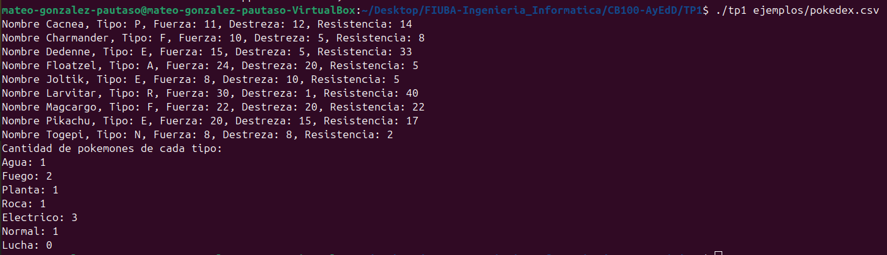

<div align="right">

</div>

# TP1

## Alumno: Mateo Gonzalez Pautaso - 111699 - magonzalezp@fi.uba.ar

- Para compilar o utilizando el makefile:

```bash
gcc -std=c99 -Wall -Wconversion -Wtype-limits -pedantic -Werror -O2 -g src/*.c tp1.c -o tp1
```
```bash
make tp1
```

- Para ejecutar:

```bash
./tp1 ejemplos/pokedex.csv
```

- Para ejecutar con valgrind:
```bash
valgrind --leak-check=full --track-origins=yes --show-reachable=yes --error-exitcode=2 --show-leak-kinds=all --trace-children=yes ./tp1 ejemplos/pokedex.csv
```

---

##  Funcionamiento

<div align="center">

</div>
&nbsp;

El programa recibe el nombre de un archivo por parametro, verificando que efectivamente se haya pasado uno y en el caso que no se haya hecho, imprimira un mensaje de error y terminara la ejecución del programa. Luego lo abre con la función abrir_archivo_csv() asignandole memoria, la funcion retorna un struct archivo_csv donde se almacena el separador y un FILE* a un archivo csv.

Posterior a esta tarea se crea una pokedex con pokedex_crear() y se asigna memoria nuevamente, dicha funcion retorna un struct pokedex. La pokedex tiene una variable para contabilizar los pokemones en ella, una para llevar registro del tamaño de la misma, donde en caso que se llene se realiza una realocación de memoria con realloc(), y un puntero a un vector de struct pokemon. El struct pokemon cuenta con un puntero al nombre y 4 campos de cualidades del mismo

Como ambas funciones que crean las estructuras asignan memoria, verificamos que esta misma no haya fallado y seguimos con la ejecución de nuestro programa.

<div align="center">

</div>
&nbsp;

Seguidamente se crea un arreglo de punteros a funciones, con estas mismas se castearan las columnas del archivo csv a los datos requeridos por el programa. Dichas funciones deben estar en el mismo orden de aparición que las columnas del archivo a procesar para evitar problemas de tipos de datos distintos.

**Pikachu;E;20;15;17**

Como nuestro archivo tiene lineas de este formato, el orden de aparicion de las funciones debe ser tal cual estan implementadas en tp1.c, si nuestro archivo tuviese distinta disposición habría que ajustar el orden. Luego de esto, se crean las variables donde se copiara la informacion de las columnas de los archivos. Cuando creamos el arreglo de punteros a ctx almacenamos las direcciones de memoria de las variables para cargar los pokemones a la pokedex una vez sean parseadas correctamente.

Al poner la función leer_linea_csv() que devuelve la cantidad de columnas leidas correctamente, el programa se ejecutara hasta que se produzca una falla o se llegue al final del archivo. Pero esta función no solo retorna este dato sino que también se encarga de leer linea a linea el archivo, separar estas mismas segun el separador y armar un char **split_strings donde estaran los datos de las variables de void \*ctx[5]. Una vez finalizadas estas tareas, libera la memoria del char\*\* y retorna el dato esperado. En el caso que alguna asignación de memoria falle, alguna función sea NULL o el parseo no se ejecute correctamente, finaliza la ejecución y retorna en que columna fallo.

<div align="center">

</div>
&nbsp;

Una vez los datos fueron cargados a las variables, se conforma el struct pokemon para poder ser agregado a la pokedex. Este pokemon es pasado como parametro a pokedex_agregar_pokemon() que se encarga de asignar memoria para el nombre y ordenarlo dentro del arreglo punteros a pokemones, como siempre ante cualquier tipo de falla o funcionamiento inesperado del programa se libera memoria y finaliza. Una vez cargado el pokemon, se libera la memoria de la variable utilizada como auxiliar y se repite el ciclo while sucesivamente.

Al momento de salir del while, se recurre a la funcion imprimir_pokedex() que cuenta la cantidad de pokemones por tipo mediante contar_pokemon_segun_tipo() y luego imprime el formato requerido por pantalla.

<div align="center">

</div>
&nbsp;

Finalmente cuando el programa cumple su proposito, se libera toda la memoria utilizada por el archivo csv y la pokedex, esto se hace mediante el uso de las respectivas funciones cerrar_archivo_csv() y pokedex_destruir().

A lo largo del trabajo práctico tome la decisión de ahorrar memoria utilizando realloc() antes que tamaños arbitrarios grandes para nombres de pokemones o para el tamaño del arreglo donde se guardan los struct pokemon. Esto es a costa de sacrificar tiempo, ya que realloc() tiene una complejidad de O(n) frente a O(1) que tendría malloc() al hacer asignaciones de memoria mas grandes. También otro motivo fue para aprovechar y prácticar los manejos de memoria y sus posibles fallas, ver como solucionarlas y poder seguir con el trabajo adelante. La implementación del algoritmo de ordenamiento por inserción fue tomada ya que al no poder usar qsort() u otros algoritmos integrados, decidi implementar ese por mi cuenta y hacer sus respectivas modificaciones para que cumpla con los requisitos del trabajo.

Todas las funciones mencionadas anteriormente y las funciones internas estan explicadas en el apartado de **Respuestas a las preguntas teóricas**. Las funciones implementadas por mi cuenta tienen la documentacion y explicacion dentro de los archivos, también son desarrolladas en el apartado mencionado anteriormente.

---

## Respuestas a las preguntas teóricas

## CSV

__struct archivo_csv *abrir_archivo_csv(const char *nombre_archivo,char separador)__

La funcion cuenta con instrucciones simples O(1), malloc con una complejidad de O(1) ya que solo asigna memoria y con fopen() que tambien tiene una complejidad de O(1). En el caso que la apertura del archivo falle, entraríamos al if que contiene un free(), pero este al ser nuevamente de complejidad O(1) no nos afectaría. Por lo tanto la complejidad temporal de la función es O(1).

__size_t leer_linea_csv(struct archivo_csv \*archivo, size_t columnas, bool (*funciones[])(const char *, void *), void *ctx[])__

La funcion cuenta con instrucciones simples O(1), con fgets() que tiene una complejidad O(buffer) siendo buffer = 250 la cantidad de caracteres que esta definida por el buffer, donde en el peor de los casos llegaria a esa complejidad. fgets() recorre el archivo hasta encontrar \n, el final del archivo o leer la cantidad de caracteres requeridos. Despues esta la funcion split() con una complejidad O(n²), esto es explicado posteriormente en su respectivo apartado. Luego recorre un for con complejidad O(col), siendo col la cantidad de columnas del archivo, que aplica funciones que se encargará de convertir el valor leído a un tipo específico. Las funciones tienen complejidades de O(c) siendo n la cantidad de caracteres de los substrings, mas adelante son explicadas. Por lo que el loop for tiene una complejidad de O(col * c) haciendo que forme parte de la familia O(n²), en el caso que la funcion devuelva false o sea NULL, se agregaría mas complejidad temporal por la funcion liberar_partes(). Si esto pasa, la función pasaria a ser O(col * c + col) o O(n²) ya que liberar_partes() hace free() pero dentro de un for dependiendo de las columnas del archivo, la funcion no fallaría siempre en cada ciclo ya que se finaliza la ejecución. Una vez fuera del loop for se utiliza de nuevo la funcion liberar_partes(). Por lo que la complejidad total de la funcion seria O(buffer + split + col * c + col) formando parte de O(n²)

__void cerrar_archivo_csv(struct archivo_csv *archivo)__

La funcion se encarga de cerrar el archivo en caso que este y el struct no sean NULL, si esto ocurre utiliza fclose() que tiene una complejidad O(1). Luego se recurre a free(archivo) para liberar la memoria ocupada por el struct archivo_csv y tiene una complejidad O(1). Por lo tanto la complejidad temporal de la función es O(1).

__char **split(char *buffer, char separador, size_t columnas)__

La funcion se encarga de separar el buffer en substrings según su separador, por lo que cuenta con un malloc() con complejidad O(1) para asignar la memoria de los char*. Luego utiliza una variable que depende de strlen(buffer) que tiene una complejidad O(buffer), siendo buffer = 250 la cantidad de caracteres. Despues entra a un ciclo for con complejidad O(strlen(buffer)), explicada anteriormente, donde en caso que el caracter coincida con el separador entra en un if. Al cumplirse esta condicion, se utiliza un malloc con O(1) y luego recurre a slice(), esta cuenta con complejidad O(c) siendo c la cantidad de caracteres dentro de los rangos. En caso que la funcion falle se recurre a liberar_partes con complejidad O(col), haciendo que el for tenga una complejidad O(buffer * c + col), sino simplemente es O(buffer * c). Esto es considerando el peor de los casos donde habría practicamente la misma cantidad de separadores que caracteres. Por lo que la función total en si tiene una complejidad total de O(n²).

__void liberar_partes(char **split_strings, size_t columnas)__

La funcion se encarga de liberar la memoria utilizada por los char *substrings, por lo que recorre un for con complejidad O(col) y haciendo free() con complejidad O(1). Una vez terminado el ciclo, libera la memoria de char ** usando free() nuevamente. Por lo que la funcion tiene una complejidad O(col) formando parte de O(n),

__void slice(const char *string, char *substring, size_t inicio, size_t fin)__

La función es basicamente una modificación de strncpy() para utilizar indices desde donde hasta donde copiar, como strncpy tiene una complejidad de O(c) siendo c la cantidad de caracteres a ser copiados según los indices. Por esto mismo la funcion pertene a O(n)

## Pokedex

__struct pokedex *pokedex_crear()__

La funcion asigna memoria para el struct pokedex utilizando malloc(), que es O(1), y luego utiliza calloc() para asignar e inicializar memoria para los struct pokemon. Lo bueno de calloc() es que inicializa la memoria y es igual de eficiente que malloc(), si tuviesemos que asignar la memoria manualmente con un ciclo for dependeriamos del tamaño a asignar siendo O(n). Por estos motivos la función es O(1).

__bool pokedex_agregar_pokemon(struct pokedex *pokedex, struct pokemon pokemon)__

La función se encarga de agregar los pokemones ordenados al vector, en el caso que este se encuentre lleno la función debe realocar la memoria para este utilizando realloc(). Como realloc() debe recorrer t elementos, siendo t el nuevo tamaño, cuenta con una complejidad de O(t) ya que debemos considerar el peor de los casos. Luego utiliza malloc() con O(1) para asignar memoria al nombre del pokemon pero dentro de este utilizamos strlen(c) siendo c la cantidad de caracteres del nombre, tomando una complejidad de O(c). Despues de las asignaciones de memoria se recurre a un algoritmo de ordenamiento llamado Inserción, que en el peor de los casos, tiene una complejidad de O(n²), esto es explicado en su posterior apartado. La funcion tiene una complejidad de O(t + c + n²) por lo que pertenecería a la familia de O(n²).

__size_t pokedex_cantidad_pokemones(struct pokedex *pokedex)__

La función es muy simple ya que solo devuelve la cantidad de pokemones dentro de la pokedex, por lo que la complejidad seria solamente O(1).

__const struct pokemon *pokedex_buscar_pokemon(struct pokedex *pokedex, const char *nombre)__

La función recorre los pokemones y los compara con el recibido, para esto utiliza un bucle for que depende de la cantidad de pokemones O(cantidad) y luego usa strcmp() que compara caracter a caracter ambos strings. La funcion strcmp() tiene una complejidad O(c) siendo c la cantidad de caracteres del string, esperando que coincidan y encontremos al pokemon. Por lo que la funcion tiene una complejidad O(cantidad * c) que la hace formar parte de O(n²).

__size_t pokedex_iterar_pokemones(struct pokedex \*pokedex, bool (*funcion)(struct pokemon *, void *), void *ctx)__

La función invoca los pokemones ordenados por nombre utilizando un bucle for dependiente de la cantidad de pokemones y lo pasa como parametro a una funcion. El bucle for tiene complejidad O(cantidad) sumado a la funcion con complejidad O(x) siendo x un parametro desconocido ya que no sabemos lo que hacen dichas funciones. Por lo que la funcion entera tiene complejidad O(cantidad * x) pero sacando de consideración los datos desconocidos, la funcion es O(n).

__void pokedex_destruir(struct pokedex *pokedex)__

La funcion libera toda la memoria utilizada por la pokedex mediante un ciclo for que cuenta con complejidad O(cantidad) dependiendo de los pokemones. Utiliza free() en cada iteracion, una vez finalizado libera el resto. free() tiene complejidad O(1), por lo que la funcion termina siendo de la familia O(n).

__bool insertion_sort(struct pokedex *pokedex, struct pokemon pokemon)__

En esta función se implementa un algoritmo de ordenamiento por inserción que se basa en recorrer el vector e ir buscando el menor elemento, una vez encontrado se posiciona en la primera posicion y luego se recorre nuevamente para encontrar el otro. Así sucesivamente hasta que el vector quede ordenado, este algoritmo tiene como mejor caso complejidad O(n) que ocurriría cuando el vector esta ordenado o cerca de estarlo. En cambio si el vector esta ordenado su complejidad pasa a ser O(n²) ya que compara cada elemento con todos los del vector, el vector[:i] esta ordenado. Este tiene cierta ventaja ante un algoritmo de ordenamiento por selección que tiene siempre complejidad O(n²). El algoritmo de Inserción funciona de la siguiente manera:

| 0 | 1 | 2 | 3 | 4 | 5 | 6 |
|:-:|:-:|:-:|:-:|:-:|:-:|:-:|
| f | a | e | c | g | d | b |
| a | f | e | c | g | d | b |
| a | e | f | c | g | d | b |
| a | c | e | f | g | d | b |
| a | c | e | f | g | d | b |
| a | c | d | e | f | g | b |
| a | b | c | d | e | f | g |

La implementación de la función utiliza un while dependiente de la cantidad_de_pokemones - 1 para no iterar sobre este ultimo y de strcmp() para comparar los nombres alfabeticamente. strcmp() tiene complejidad O(c) siendo c la cantidad de caracteres, como ya fue explicado en pokedex_buscar_pokemon, y por este motivo el while tiene una complejidad O(cantidad) o O(c) dependiendo cual sea mayor de los dos. Luego en el ciclo se realiza una realocación de memoria para el nombre del pokemon, como ya explicamos anteriormente realloc es O(n), y despues se pasa a la asignación de datos siendo O(n). Una vez salido del ciclo se obtiene la posición de donde copiar los datos del pokemon pasado por parametro y se repite la funcion de realloc() y asignar_datos_pokemones(). La complejidad de la funcion seria O((c || cantidad) * (n + n) + 2n) por lo que formaría parte de la familia O(n²)

__void asignar_datos_pokemones(struct pokedex *pokedex, struct pokemon pokemon, int i)__

La funcion se encarga simplemente de hacer la transferencia de los datos y copiarlos a las nuevas direcciones de memoria. La funcion strcpy() tiene una complejidad O(c) siendo c la cantidad de los caracteres de origen a copiarse en destino, luego el resto de las asignaciones son O(1). Por esto mismo la función tiene complejidad O(n).

## TP1

__void contar_pokemon_segun_tipo(struct pokedex *pokedex, int cantidad_tipo[])__

La función cuenta los pokemones por tipo para almacenar esta información y llevar un registro. Se recorre un for que depende de la cantidad de pokemones, por lo que tiene una complejidad O(cantidad) y para saber de que tipo son y contabilizarlo, se usa un switch/case. swtich/case lo que haces es evaluar la entrada y saltar directamente al caso por lo que tiene complejidad O(1), no tiene que evaluar cada condición como en el caso de un if/else. Por este motivo la función tiene complejidad O(n).

__void imprimir_pokedex(struct pokedex *pokedex)__

La función se encarga de imprimir la información en la pokedex con el formato requerido por el enunciado, pero primero utiliza la función contar_pokemon_segun_tipo() para obtener los datos faltantes. La complejidad de la función depende del bucle for O(cantidad) y de contar_pokemon_segun_tipo() que es O(n), por lo que sería O(cantidad + n), derivando en la familia de O(n).

__bool crear_string_nuevo(const char *str, void *ctx)__

La función crea un string con memoria para almacenar la información del nombre leida del archivo CSV. Para esto mismo utiliza un malloc() con complejidad O(1) y luego un strcpy() con complejidad O(c) siendo c la cantidad de caracteres que tenga el nombre. Por estos motivos la funcion completa tiene una complejidad de O(n).

__bool leer_caracter(const char *str, void *ctx)__

La función se encarga de castear el caracter a un char* por lo que solo tiene complejidad de O(1).

__bool leer_int(const char *str, void *ctx)__

La función se encarga de castear el string a un entero pero utiliza la función sscanf que recibe el string en si, el formato de conversion y el destino para ser copiado. Dicha función tiene complejidad O(c) siendo c la cantidad de caracteres que tenga la cadena de numeros, por eso la función completa tiene una complejidad O(n).