# sched

### Cambio de contexto
#### Informe: Utilizar GDB para visualizar el cambio de contexto. Realizar una captura donde se muestre claramente:
- El cambio de contexto
- El estado del stack al inicio de la llamada de context_switch
- Cómo cambia el stack instrucción a instrucción
- Cómo se modifican los registros luego de ejecutar iret

##### Cambio de Contexto 
<div align="center">
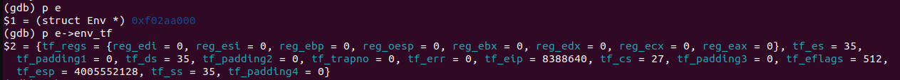
</div>
Esta imagen muestra cómo están los registros y los atributos del trapframe antes de empezar a ejecutar context_switch

##### Estado del stack al inicio de la llamada de context_switch
<div align="center">

</div>


##### Stack instrucción a instrucción
En este apartado, se listarán imágenes de cómo se modifican el stack y los registros instrucción a instrucción durante la ejecución de context_switch

<div align="center">
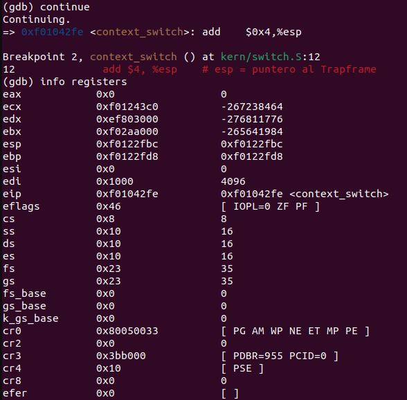
</div>

<div align="center">
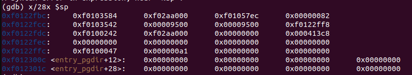
</div>

<div align="center">
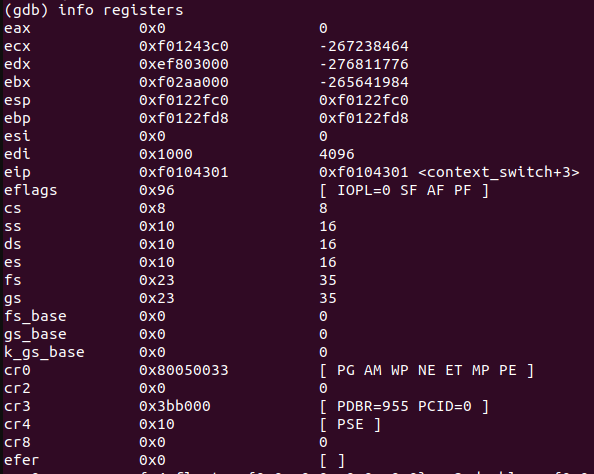
</div>

<div align="center">
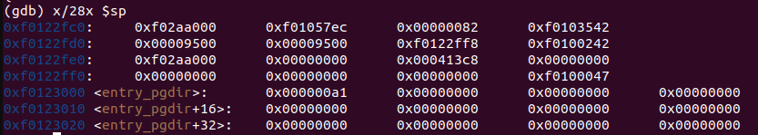
</div>

<div align="center">
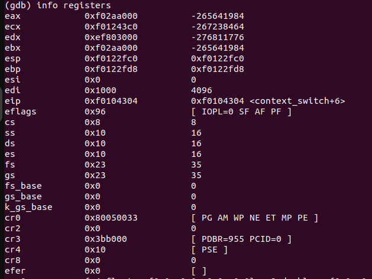
</div>

<div align="center">
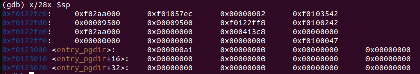
</div>

<div align="center">
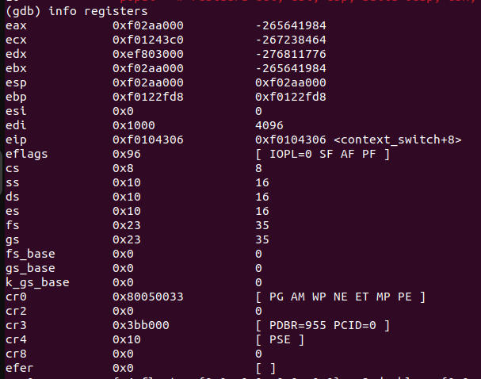
</div>

<div align="center">
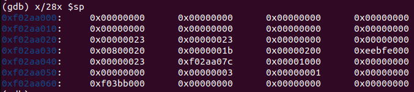
</div>

<div align="center">
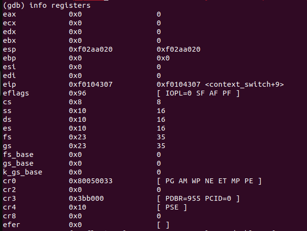
</div>

<div align="center">
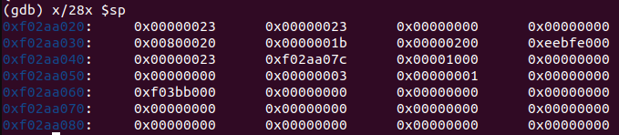
</div>

<div align="center">
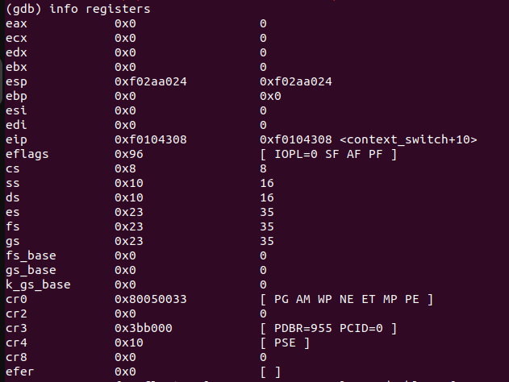
</div>

<div align="center">
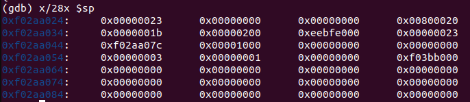
</div>

<div align="center">
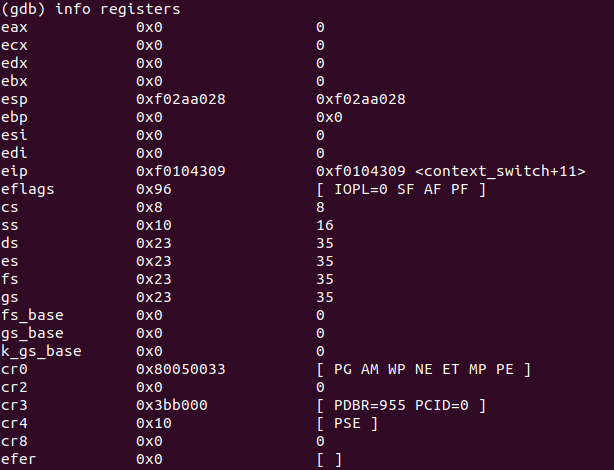
</div>

<div align="center">
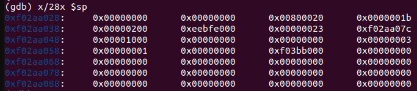
</div>

###### Registros y estado del stack antes de ejecutar iret
<div align="center">
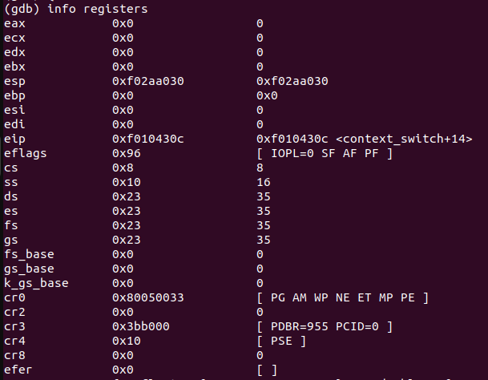
</div>


<div align="center">
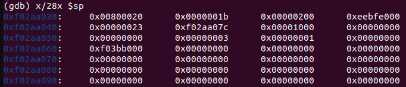
</div>

###### Registros después de ejectuar iret

<div align="center">

</div>

### Scheduler con prioridades
#### Informe: explicar y describir la lógica de la implementación de esta política.
Cuando se crea un nuevo proceso, éste inicia con la prioridad más alta(en nuestro caso 0) definida mediante la constante llamada HIGHEST_PRIORITY. Esto ocurre siempre, excepto en un caso: cuando se crea un proceso hijo. Estos tipos de procesos no inician con la prioridad más alta, sino que heredan la prioridad que tenia su proceso padre a la hora de hacer fork. Esto se diseño asi para que un proceso no pueda aprovecharse de que sus hijos comienzan con prioridad más alta y así poder correr más tiempo.
#### Priority Drop
El funcionamiento para que un priority drop ocurra es el siguiente: cuando un proceso ya tuvo 5 runs (señalizado con la constante MAX_RUNS_BEFORE_DROP) en el mismo nivel de prioridad (contado mediante el atributo env_priority_runs). Una vez que el nivel de prioridad de un proceso es la mas baja, no se disminuye más.
#### Priority Boosting
Para reducir lo mas posible el riesgo de starvation, cada 40 llamadas al scheduler (modificable mediante la constante MAX_CALLS_BEFORE_BOOST y las calls contadas mediante las estadisticas del scheduler con el atributo sched_calls) se hace un priority boost a todos los procesos.
#### Selección de Procesos
A la hora de una llamada al scheduler, el scheduler busca el proceso en estado RUNNABLE con mayor prioridad. En el caso de que haya varios procesos en la misma prioridad, se hace Round Robin entre ellos. Si no se encuentra ningún proceso en estado RUNNABLE y el proceso actual está en estado RUNNING, se continúa ejecutando el proceso actual.
#### Implementacion
La función void drop_priority(struct Env* env) disminuye la prioridad de un proceso, respetando el límite mínimo de prioridad. Para el boosteo, utilizamos void boost_priorities() cuya utilidad es aumentar la prioridad de todos los procesos al nivel máximo de prioridad.


Ejemplo de un proceso que no baja de prioridad:

```bash

    [00000000] new env 00001000
    0xf024d590
    ---High priority---
    i am environment 00001000 | current priority 0
    ---High priority---
    i am environment 00001000 | current priority 0
    ---High priority---
    i am environment 00001000 | current priority 0
    ---High priority---
    i am environment 00001000 | current priority 0

    El proceso 4096 bajo de prioridad; se ejecuto muchas veces en la misma prioridad

    ---High priority---
    i am environment 00001000 | current priority 1
    ---High priority---
    i am environment 00001000 | current priority 1
    ---High priority---
    i am environment 00001000 | current priority 1

    Se boostean las prioridades de todos los procesos
    
    ---High priority---
    i am environment 00001000 | current priority 0
    ---High priority---
    i am environment 00001000 | current priority 0
    ---High priority---
    i am environment 00001000 | current priority 0
    ---High priority---
    i am environment 00001000 | current priority 0

    El proceso 4096 bajo de prioridad; se ejecuto muchas veces en la misma prioridad

    ---High priority---
    i am environment 00001000 | current priority 1
    ---High priority---
    i am environment 00001000 | current priority 1
    ---High priority---
    i am environment 00001000 | current priority 1
    ---High priority---
    i am environment 00001000 | current priority 1

    El proceso 4096 bajo de prioridad; se ejecuto muchas veces en la misma prioridad
    Se boostean las prioridades de todos los procesos

    ---High priority---
    i am environment 00001000 | current priority 0
    ---High priority---
    i am environment 00001000 | current priority 0
    ---High priority---
    i am environment 00001000 | current priority 0

    El proceso 4096 bajo de prioridad; se ejecuto muchas veces en la misma prioridad

    ---High priority---
    i am environment 00001000 | current priority 1
    ---High priority---
    i am environment 00001000 | current priority 1
    [00001000] exiting gracefully
    [00001000] free env 00001000
    No runnable environments in the system!

    Stats Sched
    Scheduler calls: 27
    Times the processor halted: 1
    Total priority boosts: 2
    Total priority drops by scheduler: 4
    Total processes scheduled: 26

    Scheduler's history of the last 26 executed and selected processes
    ENVID: 4096
    ENVID: 4096
    ENVID: 4096
    ENVID: 4096
    ENVID: 4096
    ENVID: 4096
    ENVID: 4096
    ENVID: 4096
    ENVID: 4096
    ENVID: 4096
    ENVID: 4096
    ENVID: 4096
    ENVID: 4096
    ENVID: 4096
    ENVID: 4096
    ENVID: 4096
    ENVID: 4096
    ENVID: 4096
    ENVID: 4096
    ENVID: 4096
    ENVID: 4096
    ENVID: 4096
    ENVID: 4096
    ENVID: 4096
    ENVID: 4096
    ENVID: 4096


```

Ejemplo de un proceso que baja su prioridad via la syscall `sys_droppriority`

```bash

    [00000000] new env 00001000
    0xf0244c00
    ---Low priority---
    i am environment 00001000 | current priority 0
    i am environment 00001000 | current priority after drop 1
    ---Low priority---
    i am environment 00001000 | current priority 1
    i am environment 00001000 | current priority after drop 2
    ---Low priority---
    i am environment 00001000 | current priority 2
    i am environment 00001000 | current priority after drop 2
    ---Low priority---
    i am environment 00001000 | current priority 2
    i am environment 00001000 | current priority after drop 2
    ---Low priority---
    i am environment 00001000 | current priority 2
    i am environment 00001000 | current priority after drop 2
    ---Low priority---
    i am environment 00001000 | current priority 2
    i am environment 00001000 | current priority after drop 2
    ---Low priority---
    i am environment 00001000 | current priority 2
    i am environment 00001000 | current priority after drop 2

    Se boostean las prioridades de todos los procesos

    ---Low priority---
    i am environment 00001000 | current priority 0
    i am environment 00001000 | current priority after drop 1
    ---Low priority---
    i am environment 00001000 | current priority 1
    i am environment 00001000 | current priority after drop 2
    ---Low priority---
    i am environment 00001000 | current priority 2
    i am environment 00001000 | current priority after drop 2
    ---Low priority---
    i am environment 00001000 | current priority 2
    i am environment 00001000 | current priority after drop 2
    ---Low priority---
    i am environment 00001000 | current priority 2
    i am environment 00001000 | current priority after drop 2
    ---Low priority---
    i am environment 00001000 | current priority 2
    i am environment 00001000 | current priority after drop 2
    ---Low priority---
    i am environment 00001000 | current priority 2
    i am environment 00001000 | current priority after drop 2

    Se boostean las prioridades de todos los procesos

    ---Low priority---
    i am environment 00001000 | current priority 0
    i am environment 00001000 | current priority after drop 1
    ---Low priority---
    i am environment 00001000 | current priority 1
    i am environment 00001000 | current priority after drop 2
    ---Low priority---
    i am environment 00001000 | current priority 2
    i am environment 00001000 | current priority after drop 2
    ---Low priority---
    i am environment 00001000 | current priority 2
    i am environment 00001000 | current priority after drop 2
    ---Low priority---
    i am environment 00001000 | current priority 2
    i am environment 00001000 | current priority after drop 2
    ---Low priority---
    i am environment 00001000 | current priority 2
    i am environment 00001000 | current priority after drop 2
    [00001000] exiting gracefully
    [00001000] free env 00001000
    No runnable environments in the system!

    Stats Sched
    Scheduler calls: 29
    Times the processor halted: 1
    Total priority boosts: 2
    Total priority drops by scheduler: 0
    Total processes scheduled: 28

    Scheduler's history of the last 28 executed and selected processes
    ENVID: 4096
    ENVID: 4096
    ENVID: 4096
    ENVID: 4096
    ENVID: 4096
    ENVID: 4096
    ENVID: 4096
    ENVID: 4096
    ENVID: 4096
    ENVID: 4096
    ENVID: 4096
    ENVID: 4096
    ENVID: 4096
    ENVID: 4096
    ENVID: 4096
    ENVID: 4096
    ENVID: 4096
    ENVID: 4096
    ENVID: 4096
    ENVID: 4096
    ENVID: 4096
    ENVID: 4096
    ENVID: 4096
    ENVID: 4096
    ENVID: 4096
    ENVID: 4096
    ENVID: 4096
    ENVID: 4096

```

Ejemplo de ambos procesos ejecutandose a la vez:

```bash

    [00000000] new env 00001000
    0xf024d590
    [00000000] new env 00001001
    0xf0244c00
    ---High priority---
    i am environment 00001000 | current priority 0
    ---High priority---
    i am environment 00001000 | current priority 0
    ---Low priority---
    i am environment 00001001 | current priority 0
    i am environment 00001001 | current priority after drop 1
    ---High priority---
    i am environment 00001000 | current priority 0
    ---Low priority---
    i am environment 00001001 | current priority 1
    i am environment 00001001 | current priority after drop 2
    ---High priority---
    i am environment 00001000 | current priority 0
    

    El proceso 4096 bajo de prioridad; se ejecuto muchas veces en la misma prioridad

    ---High priority---
    i am environment 00001000 | current priority 1

    Se boostean las prioridades de todos los procesos
    
    ---High priority---
    i am environment 00001000 | current priority 0
    ---Low priority---
    i am environment 00001001 | current priority 0
    i am environment 00001001 | current priority after drop 1
    ---High priority---
    i am environment 00001000 | current priority 0
    ---High priority---
    i am environment 00001000 | current priority 0
    ---Low priority---
    i am environment 00001001 | current priority 1
    i am environment 00001001 | current priority after drop 2
    ---High priority---
    i am environment 00001000 | current priority 0
    ---Low priority---
    i am environment 00001001 | current priority 2
    i am environment 00001001 | current priority after drop 2
    
    El proceso 4096 bajo de prioridad; se ejecuto muchas veces en la misma prioridad
    
    ---High priority---
    i am environment 00001000 | current priority 1

    Se boostean las prioridades de todos los procesos
    
    ---High priority---
    i am environment 00001000 | current priority 0
    ---Low priority---
    i am environment 00001001 | current priority 0
    i am environment 00001001 | current priority after drop 1
    ---Low priority---
    i am environment 00001001 | current priority 1
    i am environment 00001001 | current priority after drop 2
    ---High priority---
    i am environment 00001000 | current priority 0
    ---Low priority---
    i am environment 00001001 | current priority 2
    i am environment 00001001 | current priority after drop 2
    ---Low priority---
    i am environment 00001001 | current priority 2
    i am environment 00001001 | current priority after drop 2

    El proceso 4096 bajo de prioridad; se ejecuto muchas veces en la misma prioridad

    ---High priority---
    i am environment 00001000 | current priority 1

    Se boostean las prioridades de todos los procesos
    
    ---High priority---
    i am environment 00001000 | current priority 0
    ---Low priority---
    i am environment 00001001 | current priority 0
    ---High priority---
    i am environment 00001000 | current priority 0
    i am environment 00001001 | current priority after drop 1
    ---High priority---
    i am environment 00001000 | current priority 0
    ---Low priority---
    i am environment 00001001 | current priority 1
    ---High priority---
    i am environment 00001000 | current priority 0
    i am environment 00001001 | current priority after drop 2
    
    El proceso 4096 bajo de prioridad; se ejecuto muchas veces en la misma prioridad
    Se boostean las prioridades de todos los procesos
    
    ---Low priority---
    i am environment 00001001 | current priority 0
    i am environment 00001001 | current priority after drop 1
    ---High priority---
    i am environment 00001000 | current priority 0
    ---High priority---
    i am environment 00001000 | current priority 0
    ---Low priority---
    i am environment 00001001 | current priority 1
    i am environment 00001001 | current priority after drop 2
    
    ---High priority---
    i am environment 00001000 | current priority 0
    [00001000] exiting gracefully
    [00001000] free env 00001000

    ---Low priority---
    i am environment 00001001 | current priority 2
    i am environment 00001001 | current priority after drop 2

    Se boostean las prioridades de todos los procesos
    
    ---Low priority---
    i am environment 00001001 | current priority 0
    i am environment 00001001 | current priority after drop 1
    ---Low priority---
    i am environment 00001001 | current priority 1
    i am environment 00001001 | current priority after drop 2
    ---Low priority---
    i am environment 00001001 | current priority 2
    i am environment 00001001 | current priority after drop 2
    ---Low priority---
    i am environment 00001001 | current priority 2
    i am environment 00001001 | current priority after drop 2
    ---Low priority---
    i am environment 00001001 | current priority 2
    i am environment 00001001 | current priority after drop 2
    ---Low priority---
    i am environment 00001001 | current priority 2
    i am environment 00001001 | current priority after drop 2
    [00001001] exiting gracefully
    [00001001] free env 00001001

    Se boostean las prioridades de todos los procesos

    No runnable environments in the system!

    Stats Sched
    Scheduler calls: 60
    Times the processor halted: 1
    Total priority boosts: 6
    Total priority drops by scheduler: 4
    Total processes scheduled: 59

    Scheduler's history of the last 59 executed and selected processes
    ENVID: 4096
    ENVID: 4097
    ENVID: 4096
    ENVID: 4097
    ENVID: 4096
    ENVID: 4097
    ENVID: 4096
    ENVID: 4097
    ENVID: 4096
    ENVID: 4097
    ENVID: 4096
    ENVID: 4097
    ENVID: 4096
    ENVID: 4097
    ENVID: 4096
    ENVID: 4097
    ENVID: 4096
    ENVID: 4097
    ENVID: 4096
    ENVID: 4097
    ENVID: 4096
    ENVID: 4097
    ENVID: 4096
    ENVID: 4097
    ENVID: 4096
    ENVID: 4097
    ENVID: 4096
    ENVID: 4097
    ENVID: 4096
    ENVID: 4097
    ENVID: 4096
    ENVID: 4097
    ENVID: 4096
    ENVID: 4097
    ENVID: 4096
    ENVID: 4097
    ENVID: 4096
    ENVID: 4097
    ENVID: 4096
    ENVID: 4097
    ENVID: 4096
    ENVID: 4097
    ENVID: 4096
    ENVID: 4097
    ENVID: 4096
    ENVID: 4097
    ENVID: 4096
    ENVID: 4097
    ENVID: 4097
    ENVID: 4097
    ENVID: 4097
    ENVID: 4097
    ENVID: 4097
    ENVID: 4097
    ENVID: 4097
    ENVID: 4097
    ENVID: 4097
    ENVID: 4097
    ENVID: 4097


```