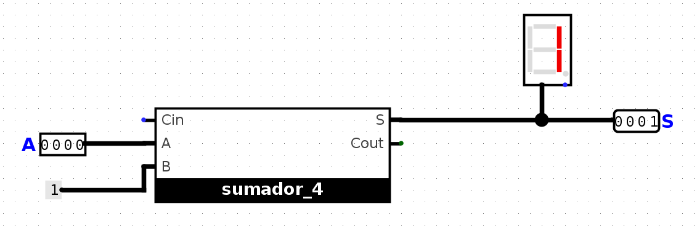
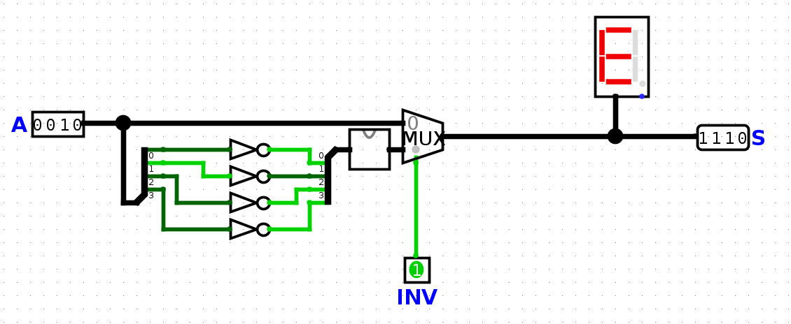

# TP Combinacionales

## Alumno: Mateo Gonzalez Pautaso - 111699 - magonzalezp@fi.uba.ar

- Para ejecutar el script:

```bash
bash check.sh
```

- Para comparar ambos archivos:

```bash
diff -s salida_catedra.txt output-entrega.txt
```

- Para ejecutar el makefile:

```bash
make
```

## Respuesta a las pregunta teórica 3.3 sobre inversor_4

Según la representacion complemento a 2, para invertir aritmeticamente un numero en binario hay que invertir todos sus bits y sumarle 1.

Por ejemplo, si tenemos el numero 0010, la operación a realizar sería la siguiente:
| 0 | 0 | 1 | 0 | Invertir bits  |
|:-:|:-:|:-:|:-:|:-:|
| 1 | 1 | 0 | 1 | +1 |
| 1 | 1 | 1 | 0 | 1 + 1 = 0 y paso uno al próximo  |
| 1 | 1 | 1 | 0 | Resultado final  |
&nbsp;
<div align="center">

</div>
El circuito incrementador_4 (dentro de inversor_4) realiza la operación sobre el numero binario. La entrada A es el numero en si y por B entra un bit para ser sumado, por la salida S obtenemos el resultado.

&nbsp;
<div align="center">

</div>
Luego tenemos el circuito de inversor_4 que cuenta con un Multiplexor para elegir entre dos entradas y reflejar la salida. En caso que la entrada de INV sea 0, la salida sera el numero original no negado. En el caso que INV sea 1, el multiplexor elige la segunda entrada que es el numero con todos sus bits negados. Este numero actua como entrada en incrementador_4 (representado con el bloque) y la salida es el numero negativo.

&nbsp;
<div align="center">

</div>
En la salida S se puede ver representado el numero cuando la entrada INV es 1, es el mismo resultado que obtuvimos anteriormente cuando hicimos la cuenta.
Como el display es hexadecimal, cuando hacemos el cambio de bits nos muestra otro numero, la tabla sería asi para un numero de 4 bits

| 0 | 1 | 2 | 3 | 4 | 5 | 6 | 7 | 8 | 9 | A | B | C | D | E | F |
|:-:|:-:|:-:|:-:|:-:|:-:|:-:|:-:|:-:|:-:|:-:|:-:|:-:|:-:|:-:|:-:|
| 0 | 1 | 2 | 3 | 4 | 5 | 6 | 7 | -8 | -7 | -6 | -5 | -4 | -3 | -2 | -1 |