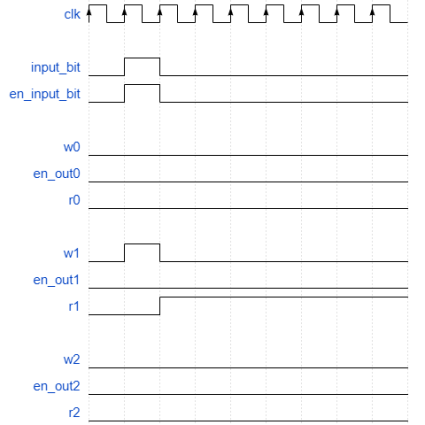
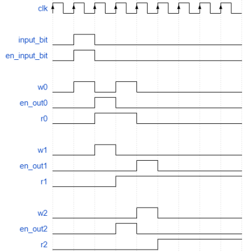

# Taller microlab - Grupo 12 [Batman]

## Secuenciales

### 1. ¿Cuáles son y qué representa cada entrada y cada salida del componente?¿Cuáles entradas deben ser consideradas como de control?

El componente **regZ** cuenta con **3 entradas** y **2 salidas**:

#### Entradas:
- **clk**:  
  Es una señal que determina el intervalo de tiempo dentro del cual los valores de salida se actualizan en base a los valores de entrada. Esta señal es un pulso que nos sirve para sincronizar las operaciones.

- **Reg_in**:  
  Esta entrada es el byte de información que está llegando al flip-flop en cada pulso del clock. Básicamente, es el dato que será guardado dentro del flip-flop cuando las entradas de control lo permitan.

- **w** _(Entrada de control)_:  
  Es una entrada de control que autoriza al flip-flop a guardar el bit de información que llegó desde `Reg_in` en cierto pulso del clock.  
  - Cuando esta entrada está en **1**, se guarda el dato dentro del registro, sobreescribiendo al anterior. 
  - Caso contrario, el valor almacenado permanece.

- **en_out** _(Entrada de control)_:  
  Es una entrada de control que, cuando está encendida, hace que el dato almacenado en el registro salga por el `Reg_output`.  
  - Si está en **0**, el `Reg_output` se considera desconectado.

#### Salidas:
- **Reg_debug**:  
  Esta salida muestra permanentemente el bit que está almacenado dentro del registro, independientemente del estado de la entrada de control `en_out`.

- **Reg_output**:  
  Si `en_out` está habilitada, se mostrará el valor almacenado en el flip-flop en su salida **Q**.

### 2. Las entradas input_bit y en_input_bit sirven para poder introducir en el circuito un valor arbitrario. Escribir una secuencia de activación y desactivación de entradas para que el registro R1 pase a tener el valor 1.

### 3. Dar una secuencia de activaciones que inicialmente ponga un valor 1 en R0, luego que este valor se transfiera a R1, luego que el valor de R2 pase a R0 y finalmente el valor de R1 a R2.

--- 
## Orgasmall

### 1. Análisis
#### Funcionamiento de circuitos
- #### ¿Cuál es el tamaño de la memoria?  

El tamaño de la memoria del procesador OrgaSmall es de **256 palabras de 8 bits**. Como cada palabra representa 1 byte, la memoria tiene una capacidad de **256 bytes**.

- #### ¿Qué tamaño tiene el PC? 

El PC tiene un tamaño de **8 bits**, ya que debe ser capaz de almacenar todas las posiciones en la memoria. Dado que las palabras en la memoria tienen 8 bits, este es el tamaño mínimo necesario.  
El PC es un registro que indica la posición en la que se encuentra el procesador en su secuencia de instrucciones.  
Otra forma de verificar el tamaño de 8 bits del PC es observando su circuito, que consiste en un flip-flop D que almacena esta capacidad.

- ####   ¿Cuántas instrucciones nuevas se podrían agregar respetando el formato de instrucción indicado?

Dado que cada CodOp se representa con un número de **5 bits**, esto permite un máximo de **32 instrucciones posibles**.  
OrgaSmall ya tiene implementadas **21 instrucciones**, por lo que quedan **11 posiciones libres** para nuevos CodOp que representen instrucciones adicionales en el microprocesador.

#### Función de Señales en Módulos de Hardware

- #### PC (Contador de Programa): ¿Qué función cumple la señal inc?  

El PC almacena la dirección de memoria de la próxima instrucción que debe ejecutarse.  
Al finalizar la instrucción actual, el PC necesita incrementar su dirección para señalar la siguiente instrucción.  
La señal **inc** permite incrementar en una posición la dirección almacenada en el flip-flop D del PC, facilitando así la progresión de las instrucciones en secuencia.

- #### ALU (Unidad Aritmético Lógica): ¿Qué función cumple la señal opW?  

La señal de control **opW** habilita a la ALU para escribir las flags en la salida Flags.  
Las flags **C, Z, y N** (carry, cero, negativo) dependen de los operandos A y B, así como del operador OP.  
Por ejemplo, si ocurre un carry en una suma, pero opW está en 0, la flag no se reflejará en la salida de 3 bits de Flags de la ALU.

- #### microOrgaSmall (DataPath): ¿Para qué sirve la señal DE_enOutImm? 

Algunas instrucciones utilizan un valor M de 8 bits que puede representar una dirección de memoria o un valor inmediato.  
Dependiendo del OpCode, **DE_enOutImm** se activa cuando M representa un valor inmediato, permitiendo que este se cargue en el BUS en el siguiente ciclo de clock.

**¿Qué parte del circuito indica qué registro se va a leer y escribir?**  
La unidad Decode, basada en el OpCode, determina qué registros (indexX, indexY) están implicados en la instrucción.  
Para saber si se debe leer o escribir en un registro, el decode envía el OpCode a la unidad de control, que activa las flags **RB_enIn** y **RB_enOut**:  
- **RB_enIn**: Indica que el registro seleccionado debe aceptar datos (escritura).  
- **RB_enOut**: Indica que el registro debe colocar sus datos en el bus (lectura).

- #### ControlUnit (Unidad de Control): ¿Cómo se resuelven los saltos condicionales?  

Los saltos condicionales se manejan en la unidad de control, que microprograma las instrucciones en secuencias de micro-instrucciones almacenadas en una memoria ROM.  
Cada micro-instrucción se ejecuta en un ciclo de clock.

Para entender los saltos condicionales, primero hay que entender como funciona el mecanismo sin ellos:
1. Lo primero que se resuelve es un **fetch**, que es el proceso donde se cargan los datos de la dirección de memoria del PC en la unidad decode (El high y low). 
2. El **decode** interpreta lo que estaba en la memoria y diferencia las partes de la instrucción que se está queriendo ejecutar (`OpCode` y parámetros).
3. Se **ejecuta** la instrucción, efectuando cada una de las micro-instrucciones que la componen.
    + ¿Cómo?: Las micro-instrucciones son direcciones de 9 bits, los 5 bits más significativos corresponden al `OpCode` y los otros 4 a la posición de la micro-instrucción actual (Lo que nos deja con un máximo de 16 para cada instrucción).
    Dentro de la unidad de control existe un componente, el **microPC**, que guarda la dirección de la micro-instrucción que se va a ejecutar (Funciona como un PC pero interno a la unidad de control). Este se va a ir incrementando en una unidad por cada clock hasta finalizar y repetir el ciclo, volviendo a comenzar con un fetch.

Cuando existen saltos condicionales, puede ser que se den las características para que las micro-instrucciones no se ejecuten en orden. Por esto la unidad de control cuenta con 3 flags que identifican cuando el `OpCode` de la instrucción corresponde a un salto condicional (En este micro son `JC`,`JZ` y `JN`). 
Si la condición para el salto condicional se cumple, esto lo hace valiéndose de las flags **C**,**Z**,**N** de la ALU, El **microPC** va a saltarse una micro-instrucción (se incrementa en 2 unidades en lugar de 1).

Tomemos como ejemplo el salto condicional `JC`. Cuando el `OpCode` de esta instrucción llega a la unidad de control, se enciende la flag que indica que se quiere hacer un salto condicional del tipo `JC`. Verifica si también se está cumpliendo el requisito, que es que **C** esté encendido.
Si **C** no estaba encendida, las condiciones para el salto condicional no se cumplieron, entonces el **microPC** va a incrementar en una unidad y ejecutar la micro-instrucción contigua.
Caso contrario, el salto condicional se cumple y provoca que el **microPC** no se incremente en 1 unidad, sino en 2. Entonces ya no estaríamos ejecutando la micro-instrucción contigua, se habría saltado una. 
El mecanismo para tratar a los saltos condicionales es idéntico para `JZ` y `JN`, pero evalúa sus **flags** correspondientes a la hora de verificar las condiciones de salto.

### 2. Ensamblar y correr

- #### Identificar el Comportamiento Esperado

Como el micro *OrgaSmall* siempre comienza con el PC en la dirección de memoria 0, lo primero que hará el programa será un salto a la dirección de memoria correspondiente a la etiqueta `seguir`.

- Con dos instrucciones `SET`, se cargarán datos en dos registros diferentes:
  - El registro **R0** recibe el valor **255** en decimal.
  - El registro **R1** recibe el valor **17** en decimal.
  
- A continuación, se ejecutará una instrucción `ADD` entre los valores de los registros, etiquetada como `siguiente`.

- Se evaluará un salto condicional de tipo **JC** (salta si hay *carry*). Si ocurre un *carry* en el `ADD`, el programa regresará a `siguiente`, creando un bucle hasta que la condición deje de cumplirse. En caso contrario, se procederá a la siguiente instrucción.

- Finalmente, se define la etiqueta `halt`, que se refiere a una instrucción `JMP halt`, creando un bucle infinito que indica el final del programa.

- #### ¿Qué lugar ocupará cada instrucción en la memoria? Detallar por qué valor se reemplazarán las etiquetas.

El programa tiene 6 instrucciones en el siguiente orden de memoria:

1. `JMP seguir`
2. `SET R0, 0xFF`
3. `SET R1, 0x11`
4. `ADD R0, R1`
5. `JC siguiente`
6. `JMP halt`

Como cada instrucción del micro es de 16 bits y el tamaño de palabra es de 8 bits, cada instrucción ocupa 2 direcciones de memoria.

| Instrucción     | Dirección (Decimal) | Dirección (Hex) |
|-----------------|----------------------|-----------------|
| JMP seguir      | 0                    | 0x00            |
| SET R0, 0xFF    | 2                    | 0x02            |
| SET R1, 0x11    | 4                    | 0x04            |
| ADD R0, R1      | 6                    | 0x06            |
| JC siguiente    | 8                    | 0x08            |
| JMP halt        | 10                   | 0x0A            |

##### Reemplazo de Etiquetas

Conociendo las direcciones, podemos determinar los valores de las etiquetas:

| Etiqueta  | Dirección (Decimal) | Dirección (Hex) |
|-----------|----------------------|-----------------|
| seguir    | 2                    | 0x02            |
| siguiente | 6                    | 0x06            |
| halt      | 10                   | 0x0A            |

- #### Ejecutar y controlar ¿cuántos ciclos de clock son necesarios para que este código llegue a la instrucción `JMP halt`?

1. **Fetch** de `JMP seguir`: 5 clocks.  
2. **Ejecución** de `JMP seguir`: 2 clocks.
3. **Fetch** y **ejecución** de `SET R0, 0xFF`: 7 clocks (5 fetch, 2 ejecución).
4. **Fetch** y **ejecución** de `SET R1, 0x11`: 7 clocks.
5. **Fetch** y **ejecución** de `ADD R0, R1`: 10 clocks (5 fetch, 5 ejecución).
6. **Fetch** de `JC siguiente`: 5 clocks.  
   - **JC** usa 3 clocks en este caso porque hubo *carry*.
7. El bucle ejecuta **fetch** y **ejecución** de `ADD R0, R1`: 10 clocks.
8. **Fetch** de `JC siguiente`: 5 clocks 
    - **JC** usa 2 clocks, no se verificó el salto con *carry*.
9. **Fetch** de `JMP halt`: 5 clocks.
   - **Ejecución** de `JMP halt`: 2 clocks.

##### Conclusión

- Se necesitan **56 clocks** para llegar al **fetch** de `JMP halt`.
- Se requieren **63 clocks** para completar la primera ejecución de `JMP halt`.

- #### ¿Cuántas microinstrucciones son necesarias para realizar el `ADD`? ¿Cuántas para el salto?

##### Instrucción `ADD`

El `ADD` requiere un total de **10 microinstrucciones**: 5 para el *fetch* y 5 para la ejecución.

1. **Fetch** (5 microinstrucciones):
   - `PC_enOut MM_enAddr`
   - `MM_enOut DE_loadH PC_inc`
   - `PC_enOut MM_enAddr`
   - `MM_enOut DE_loadL PC_inc`
   - `load_microOp`

2. **Ejecución** (5 microinstrucciones):
   - `RB_enOut ALU_enA RB_selectIndexOut=0`
   - `RB_enOut ALU_enB RB_selectIndexOut=1`
   - `ALU_OP=ADD ALU_opW`
   - `RB_enIn ALU_enOut RB_selectIndexIn=0`
   - `reset_microOp`

##### Instrucción de Salto Condicional `JC`

El salto condicional usa 5 microinstrucciones para el *fetch*. La ejecución varía dependiendo de si se cumple la condición del salto.

- **Si se cumple la condición de salto**:
  - La ejecución requiere **3 microinstrucciones**:
    - `JC_microOp load_microOp`
    - `DE_enOutImm PC_load`
    - `reset_microOp`

- **Si no se cumple la condición de salto**:
  - La ejecución requiere **2 microinstrucciones**:
    - `JC_microOp load_microOp`
    - `reset_microOp`

---
## Opcionales
### Implementación del opcional leer y escribir flags. Descripción de las modificaciones realizadas sobre el circuito.

- #### Escribir Flags

- Se añadió una **salida** en la unidad de control (Control Unit) que indica cuándo se desean modificar las flags con un valor inmediato, llamada `F_set`.
- Se agregó una **nueva entrada a la ALU** para recibir un valor inmediato desde el bus. 
  - Se utilizan los tres bits menos significativos para representar las flags: **C** (bit 0), **Z** (bit 1) y **N** (bit 2).
  - La entrada de cada registro asociado a cada flag cuenta con un **multiplexor**. Cuando la señal `F_set` está activa (desde la Control Unit), el valor del registro se actualiza con el valor inmediato correspondiente.
  - Esto permite que los registros de las flags se sobrescriban exitosamente.
- Cuando la señal `F_set` está en 0, los registros de las flags almacenan los valores resultantes de las operaciones realizadas por la ALU.
 
- #### Leer Flags

- Se agregó una **señal de control** llamada `F_load`, también desde la Control Unit, que indica cuándo se desea almacenar el estado actual de las flags en un registro.
  - Primero, se obtiene el valor actual de las flags y se almacena en los tres bits menos significativos de un **número de 8 bits** (ya que los registros son de 8 bits).
  - Se emplea un **multiplexor** controlado por la señal `F_load`. Cuando `F_load` está activa, el número de 8 bits que contiene las flags se envía a `ALU_OUT` cuando la señal `enOut` está activa.
  - Esto permite que el número se transmita al bus y esté listo para ser almacenado en el registro seleccionado.
