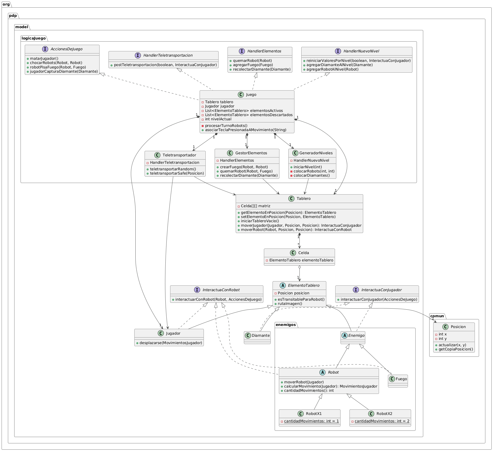

# TP1 Robots "chess cake"

## Diagrama de clases UML del Model

## Decisiones de diseño

Para el desarrollo de este trabajo nos basamos en algunos principios de diseño vistos en clase, que nosotros considerabamos importantes.

El principio fundamental para el diseño del modelo fue DIP, Dependency Inversion Principle. 
Todas las clases del modelo fueron pensadas para que las de mayor jerarquía no dependan de las de menor. Por eso creamos la clase ElementoTablero, para que tanto Tablero como Juego dependan de abstracciones.

Esto fue importante para implementar las interacciones entre las clases al momento de pasar un turno. En ElementoTablero se declaran los metodos que van a realizar las interacciones y se llama al metodo asociado en la clase de mayor jerarquia (Juego). Luego, esta clase sabrá como implementar esta interacción.

Otra de las consignas del trabajo era el polimorfismo para la implementación de los comportamientos de los distintos robots y las celdas incenciadas. Para esto creamos la clase abstracta Enemigo, que ademas extiende de la clase abstracta ElementoTablero mencionada anteriormente, donde tenemos los métodos básicos. Luego cada una de las clases de los Enemigos correspondientes extiende Enemigo y define los metodos de su superclase junto con los métodos propios que vaya a necesitar.

Al respetar este principio y asegurarnos de usar polimorfismo, tambien se termina respetando el principio OCP, Open Closed Principle pues todas las interacciones en el Juego dependen de abstracciones. En caso de que en futuro se quiera implementar, por ejemplo, un RobotX3, no haria falta modificar ninguna parte de la implementacion, mas que agregar esta nueva clase asegurandose de que herede las clases abtractas correspondientes a su comportamiento.

Tambien se respeta LSP, Liskov Substitution Principle. Al momento de las interacciones todas las subclases pueden ser reemplazadas entre si (es lo que hacemos), por lo que no se necesitan hacer verificaciones explicitas del tipo de la clase. En las interacciones, todas los ElementoTablero pueden interactuar entre si y ser reemplazados por otras subclases, todos los comportamientos son validos.

Tambien usamos el principio TDA, Tell Don't Ask, para la definicion de varios metodos en las clases. Por ejemplo, el Juego no mueve a los elementos del tablero, le pide al Tablero que lo haga por el y despues verifica que paso en ese movimiento.

A lo largo de la clases presentes en el modelo se viola varias veces el princio POLK, Principle Of Least Knowledge, pues consideramos que para respetarlo hubieramos tenido que agregar sectores de logica extra y complejizar innecesariamente el codigo, cosa que no creimos óptima pues terminariamos violando KISS, Keep It Simple Stupid.

Mientras se desarrolaba, principalmente al momento de las interacciones entre las subclases de ElementoTablero, primero comenzamos con una implementación preliminar, para verificar que todas las implementaciones fueran correctas. Luego modificamos el codigo con una estructura mas limpia, ordenada y legible. Por lo que se respetó KOP, Knuth's Optimization Principle.

Sumado a los principios ya nombrados, uno que se respeto fue Soc, Separation of Concerns. Al separar el programa en partes distintas (Patrón MVC), cada parte se enfocaba en la tarea específica y no realizaba acciones por la otra. Por ejemplo, el modelo y la vista no interactuaban entre si, era el controlador quien realizaba las acciones pertinentes.